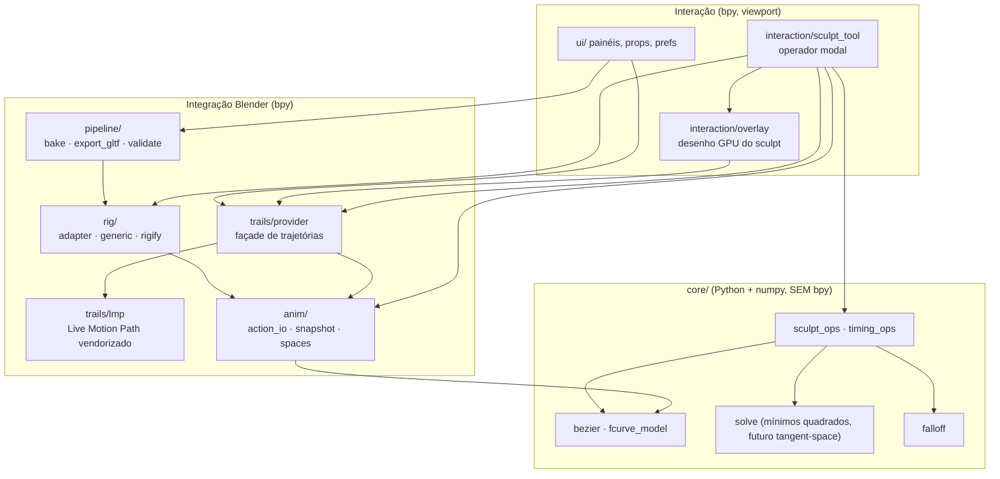
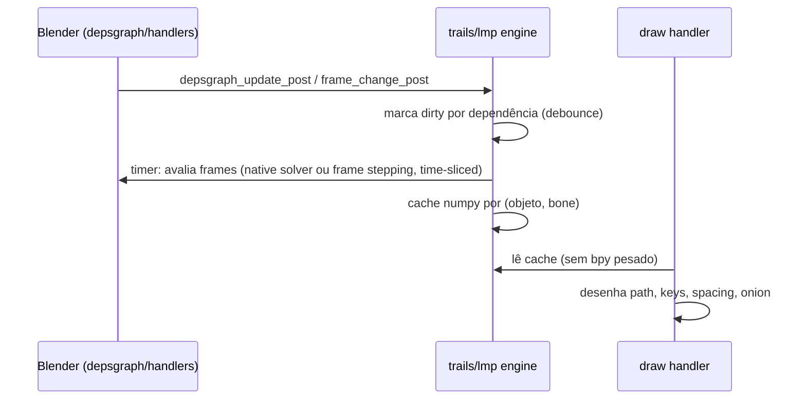
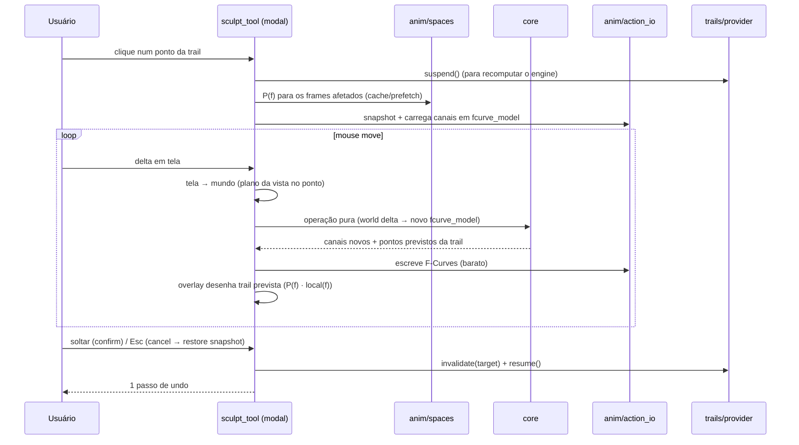

# Arquitetura

> Estado: **esqueleto** — existem `animation_sculptor/` (manifest, `__init__`, `core/` vazio, `ui/prefs.py`, `ui/panels.py`), `scripts/dev.py`, `scripts/checks.py`, `tests/unit`, `tests/blender`, CI. Os demais módulos abaixo são planejados. Atualize este documento quando a implementação divergir — o código vence, a doc é corrigida.

## Visão geral

Quatro camadas, com dependências apontando só para baixo:



Regra central ([ADR 0008](decisions/0008-pure-python-core.md)): **`core/` não importa `bpy` nem `mathutils`**. Recebe e devolve arrays numpy / dataclasses. Isso torna toda a matemática testável com `pytest` comum, rápido, fora do Blender.

## Módulos

| Módulo | Responsabilidade | Depende de | Origem |
|---|---|---|---|
| `core/fcurve_model.py` | Representação em memória de um canal: arrays `co`, `handle_left`, `handle_right`, tipos de handle e interpolação. Ida e volta sem perdas com uma F-Curve. | numpy | novo |
| `core/bezier.py` | Avaliação Bézier de F-Curve idêntica à do Blender (inclui busca de `t` para um frame, correção de handles que se cruzam no tempo). Avalia N frames vetorizado. | numpy | algoritmo de `BKE_fcurve` (Blender, GPL-2+) + `bezier_search_frame` do Motiontrail3D |
| `core/falloff.py` | Curvas de falloff (smooth, linear, sharp, constant) por distância temporal ou por índice de key. | numpy | novo (padrão do proportional editing) |
| `core/sculpt_ops.py` | Operações espaciais puras: *grab* de key, *arc drag* (resolve handles), futuramente *smooth*, *make arc*, *pins*. | bezier, falloff, solve | novo, inspirado em Motion Trail / Motiontrail3D |
| `core/timing_ops.py` | Operações temporais puras: *retime* de pose key, *spacing/ease* de segmento, futuramente *time offset*, *ranges*. | bezier | timing do Motion Trail (portado) + ease/blend do Graph Editor (referência) |
| `core/solve.py` | Mínimos quadrados amortecidos com restrições lineares (pins). Base do futuro Tangent-Space. | numpy | `MCSolver` do fork Interactive Motion Path (portado para numpy) |
| `anim/action_io.py` | Ler/escrever F-Curves via **Slotted Actions** (`action → slot → channelbag → fcurves`). Converte F-Curve ⇄ `fcurve_model`. Escrita em lote com `foreach_set` + `fcurve.update()`. | bpy, core | `compat.get_fcurves` do LMP (adaptado, só 5.2) |
| `anim/snapshot.py` | Snapshot/restore de canais para *cancel* durante o modal. Undo real fica com o sistema do Blender. | action_io | novo |
| `anim/spaces.py` | **Matriz de espaço-base por frame** `P(f)` de um pose bone: o espaço onde `location` atua. Cache por (rig, bone, frame), com detecção de "constante" (pai sem animação). | bpy | algoritmo `calculate_parent_matrix_cache` do Motiontrail3D |
| `rig/concepts.py` | Vocabulário do core: `root, hips, chest, head, upper_arm.L, forearm.L, hand.L, hand_ik.L, pole_arm.L, thigh.L, shin.L, foot.L, foot_ik.L, pole_leg.L` (+ `.R`). | — | novo |
| `rig/adapter.py` | Interface `RigAdapter`: detectar rig, mapear conceito ⇄ bone, classificar controles (translação / rotação), ler estado IK/FK, listar deform bones. | concepts | novo |
| `rig/generic.py` | Fallback: qualquer bone com canais de `location` é "controle de translação". Garante que a ferramenta funcione sem adapter. | adapter | novo |
| `rig/rigify.py` | Adapter Rigify (nomes, `IK_FK`, `IK_parent`, `DEF-*`). | adapter | novo, usando convenções do Rigify |
| `trails/lmp/` | **Live Motion Path & Onion Skin vendorizado**: engine (F-Curve / native solver / frame stepping), cache, scheduler debounced + time-sliced, handlers, desenho GPU de paths e onion skin. Namespace renomeado. | bpy | LMP (GPL-3) — [ADR 0001](decisions/0001-live-motion-path-foundation.md) |
| `trails/provider.py` | Façade estável usada pelo resto do addon: `get_trail(rig, bone) → (frames, points, keyframes)`, `suspend()/resume()` durante o sculpt, `invalidate(targets)`. Isola o resto do código do engine vendorizado. | lmp | novo |
| `interaction/sculpt_tool.py` | Operador modal "Animation Sculptor": hover, picking, drag, cancel/confirm, um passo de undo por gesto. | tudo acima | novo; matemática de tela de Motion Trail |
| `interaction/picking.py` | Hit-test em espaço de tela (pontos de key, pontos amostrados, segmentos). | bpy_extras.view3d_utils | `screen_to_world` do Motion Trail (modernizado) |
| `interaction/overlay.py` | Desenho do estado de sculpt por cima das trails do LMP: hover, seleção, falloff, preview do gesto, frame atual. | gpu, blf | padrões de `draw.py` do LMP |
| `pipeline/bake.py` | Bake control rig → deform bones (wrapper de `nla.bake` com opções corretas). | bpy, rig | nativo do Blender |
| `pipeline/export_gltf.py` | Export glTF com preset para Godot (deform only, actions, sampling). | bpy | exportador oficial |
| `pipeline/validate.py` | Checagens antes do export (escala, B-Bones, hierarquia, curvas não bakeadas). | rig | novo; problemas documentados pelo GameRig |
| `ui/` | Painéis (sidebar N › aba "Animation Sculptor"), `PropertyGroup` da cena, preferências, keymap. | — | padrões do LMP |

## Fluxo de dados

### Visualização (contínua)



### Gesto de sculpt (por arrasto)



Ponto-chave de performance: durante o arrasto **não** reavaliamos o Rigify. Para controles de translação, a trail do próprio controle é recalculada analiticamente: `world(f) = P(f) · local(f)`, com `P(f)` em cache e `local(f)` avaliado pelo `core/bezier` em numpy. É exato enquanto o controle editado não influencia o próprio pai (verdade para IK controls, torso, root). Ao soltar, o engine do LMP recalcula a verdade pelo depsgraph.

## Integração com o Blender

- **Actions**: só Slotted Actions (5.x). Acesso via `bpy_extras.anim_utils.action_get_channelbag_for_slot(action, adt.action_slot)`; criação via `action_ensure_channelbag_for_slot`. Nunca `Action.fcurves` (removido no 5.0). Detalhes: [design/animation-data.md](design/animation-data.md).
- **F-Curves**: leitura/escrita em lote com `keyframe_points.foreach_get/foreach_set` (`co`, `handle_left`, `handle_right`), depois `fcurve.update()`. Tipos de handle tratados explicitamente (AUTO/AUTO_CLAMPED viram ALIGNED quando o usuário edita tangentes).
- **Rigify**: o core nunca vê nomes de bones. O `RigifyAdapter` resolve conceitos. Edição atua sempre em **controles** (bones que o animador keya), nunca em `MCH-`/`ORG-`/`DEF-`.
- **Motion path engine**: o do LMP. Para bones usa o solver nativo (`pose.paths_calculate` em depsgraph mínimo, com `temp_override`) ou frame stepping. Nosso addon desliga a recomputação durante o gesto e invalida depois.
- **Sculpt engine**: `core/sculpt_ops` + `core/timing_ops`, orquestrados pelo operador modal.
- **Undo**: operador com `bl_options = {'REGISTER', 'UNDO'}`; o modal termina com `FINISHED` uma vez por gesto ⇒ um passo de undo. Handler `undo_post` limpa caches derivados (já existe no LMP).
- **Handlers**: os do LMP (`depsgraph_update_post`, `frame_change_post`, playback, `load_post`, `undo_post/redo_post`), todos `@persistent`.
- **Desenho**: `SpaceView3D.draw_handler_add` (POST_VIEW para 3D, POST_PIXEL para marcadores/labels), só módulo `gpu` (sem `bgl`), shaders built-in `POLYLINE_*`/`POINT_*`/`UNIFORM_COLOR`.
- **Bake/export**: operadores nativos (`nla.bake`, `export_scene.gltf`) chamados com presets. Ver [design/godot-pipeline.md](design/godot-pipeline.md).

## Estrutura do repositório (alvo)

```
AnimationSculptor/
├── animation_sculptor/                 # a extensão (única coisa empacotada)
│   ├── blender_manifest.toml
│   ├── __init__.py
│   ├── core/                      # puro: numpy, sem bpy
│   ├── anim/
│   ├── rig/
│   ├── trails/
│   │   ├── provider.py
│   │   └── lmp/                   # vendor GPL-3 (ver THIRD_PARTY_NOTICES.md)
│   ├── interaction/
│   ├── pipeline/
│   ├── ui/
│   └── THIRD_PARTY_NOTICES.md
├── tests/
│   ├── unit/                      # pytest fora do Blender (core/)
│   ├── blender/                   # pytest dentro do Blender (--background)
│   ├── assets/                    # .blend de regressão (gerados por script)
│   └── conftest.py
├── scripts/
│   ├── dev.py                     # link | test | build | validate | fetch-blender
│   ├── checks.py                  # regras estáticas (core sem bpy, nomes de bones, manifest, links)-docs
│   └── make_test_assets.py        # gera rigify_humanoid.blend / attack_test.blend
├── godot/
│   └── import_test/               # projeto Godot mínimo + script headless de validação
├── docs/
├── .github/workflows/tests.yml    # CI: unit + blender
├── pyproject.toml                 # config do pytest (unit)
├── CLAUDE.md                      # regras para agentes (aponta para docs/)
├── README.md
└── LICENSE                        # GPL-3.0-or-later
```

Diferenças em relação à proposta inicial:
- `scripts/` vira **um** `dev.py` com subcomandos (como no BlenderAddonTemplate) + gerador de assets — menos arquivos, um ponto de entrada.
- `godot/import_test/` entra no repo porque o teste final de integração precisa de um projeto Godot reprodutível.
- `docs/reference/open-source-provenance.md` existe desde já.

## Decisões arquiteturais

Ver [decisions/README.md](decisions/README.md).
