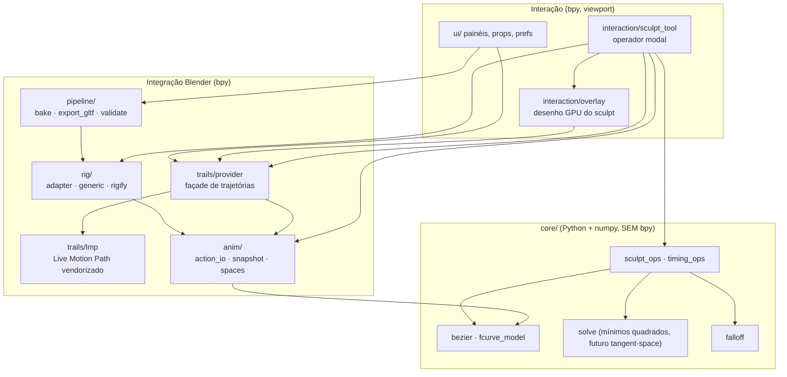
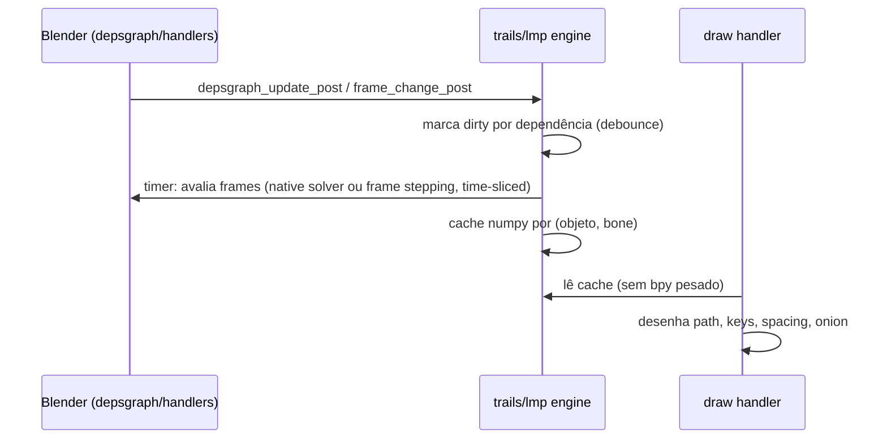
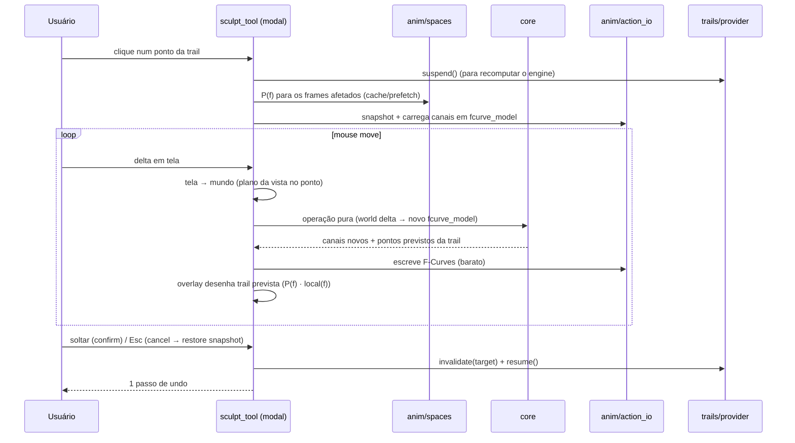

# Arquitetura

> Estado: **esqueleto + trails + interação + `core/` inicial + `rig/` + timing** — existem `animation_sculptor/` (manifest, `__init__`, `core/` com `fcurve_model`, `bezier`, `falloff`, `sculpt_ops` e `timing_ops`, `ui/props.py`, `ui/prefs.py`, `ui/panels.py`, `trails/` com `lmp/` vendorizado (P1–P5, P7–P9) e `provider.py`, `anim/` com `action_io`, `snapshot` e `spaces`, `rig/` com `concepts`, `adapter`, `generic` e `rigify`, `interaction/` com a tool, o gizmo, o overlay, o operador modal de grab/arc/retime/spacing e `timing_edit`), `scripts/dev.py` (incl. `test ui`), `scripts/checks.py`, `tests/unit`, `tests/blender` (incl. `public_rig.py`, que gera o rig Rigify público), `tests/ui` (GUI com eventos simulados, só local), CI. Ordem de registro: props, prefs, panels, trails, interaction. Os demais módulos abaixo são planejados; os marcados "spike" na tabela existem em qualidade de spike. Atualize este documento quando a implementação divergir — o código vence, a doc é corrigida.

## Visão geral

Quatro camadas, com dependências apontando só para baixo:



Regra central ([ADR 0008](decisions/0008-pure-python-core.md)): **`core/` não importa `bpy` nem `mathutils`**. Recebe e devolve arrays numpy / dataclasses. Isso torna toda a matemática testável com `pytest` comum, rápido, fora do Blender.

## Módulos

| Módulo | Responsabilidade | Depende de | Origem |
|---|---|---|---|
| `core/fcurve_model.py` | **Implementado.** `ChannelModel`: arrays float64 `co`, `hl`, `hr`, tipos de handle e interpolação por key, extrapolação; `copy`, `same_as` (bit a bit), `key_index`, `segment_of`. Ida e volta sem perdas com uma F-Curve. | numpy | novo |
| `core/bezier.py` | **Implementado.** Avaliação Bézier de F-Curve idêntica à do Blender, bit a bit (porte de `fcurve_eval_keyframes`/`_extrapolate`/`_interpolate`, `binarysearch`, `BKE_fcurve_correct_bezpart`, `findzero`/`solve_cubic`, reproduzindo float32/double). Vetorizado em frames; `bernstein()`, `segment_t()`. | numpy | Blender 5.2 `fcurve.cc` (GPL-2+), portado |
| `core/falloff.py` | **Implementado.** `weight(distância, raio, forma)`: `SMOOTH`, `LINEAR`, `SHARP`, `SPHERE`, `CONSTANT` (mesmas formas do proportional editing); 1 a distância 0, 0 no raio; raio 0 = só o ponto. Distância em frames. | numpy | novo (padrão do proportional editing) |
| `core/sculpt_ops.py` | Operações espaciais puras. **Implementado**: `grab_key` (key + handles rígidos; delta 0 = identidade) e `arc_drag(model, frame, delta, break_tangent)` (norma mínima exata dos dois `y` internos de handle do segmento; keys e `x` intocados; handles `ALIGNED` com o oposto girado mantendo seu `x`, ou `FREE` + vizinhos bit a bit idênticos; recusa segmentos não Bézier e frames fora das keys). Planejado: *smooth*, *make arc*, *pins*. | bezier, falloff, solve | novo, inspirado em Motion Trail / Motiontrail3D |
| `core/timing_ops.py` | **Implementado.** Operações temporais puras: `pose_keys`, `retime_limits`, `retime` (key + handles do frame em todo canal do escopo; ≥ 1 frame das vizinhas; nunca cria/remove keys), `segment_lambdas`/`clamp_lambdas` (`MIN_LAMBDA` 0,02; soma ≤ 0,98), `set_spacing` (só o `x` dos handles internos; políticas `PRESERVE_PATH`/`PRESERVE_SMOOTHNESS`), `spacing_from_gesture`, `retime_frames_from_screen` e `remap_frames` (preview). Futuramente *time offset*, *ranges*, retime com stretch. | bezier | timing do Motion Trail (reescrito; o código portado do Motion Trail ainda não entrou) + ease/blend do Graph Editor (referência) |
| `core/solve.py` | Mínimos quadrados amortecidos com restrições lineares (pins). Base do futuro Tangent-Space. | numpy | `MCSolver` do fork Interactive Motion Path (portado para numpy) |
| `anim/action_io.py` | **Implementado.** Ler/escrever F-Curves via **Slotted Actions** (`action → slot → channelbag → fcurves`): `channelbag`, `bone_fcurves`, `key_index`, `bone_has_key`, `refusal` (recusas com motivo), `read_channel`/`write_channel` (F-Curve ⇄ `ChannelModel`, `foreach_get/set` + `update()`), `ensure_channel` (cria no grupo do bone), `ensure_key`, `tag`. | bpy, core | `compat.get_fcurves` do LMP (adaptado, só 5.2, com escrita) |
| `anim/snapshot.py` | **Implementado.** `Snapshot.capture/restore` de canais para *cancel* durante o modal: bit a bit, inclusive removendo curvas criadas e keys inseridas. Undo real fica com o sistema do Blender. | action_io | novo |
| `anim/spaces.py` | **Implementado.** **Espaço-base `P(f)`** de um pose bone: mapa afim de `location` para o head em mundo. `location_space(ob, pb)` para o frame avaliado atual, via `Object.convert_space` LOCAL → POSE (4 conversões); respeita `use_local_location`, herança e pose do pai. `prefetch(ob, pb, frames, scene)` → `((N,4,4) numpy, constante)` por frame stepping (devolve a cena ao frame atual). `is_space_constant(ob, pb)`: conservador (sem constraints no bone; nenhum ancestral animado por F-Curve ou driver, nem com constraints; sem animação/constraints no objeto do armature e nos pais); quando constante, uma avaliação é reaproveitada. Custo medido: 0,69 ms/frame no Rigify. | bpy | novo (a fórmula `M_arm · M_pose · M_basis⁻¹` do Motiontrail3D é incorreta com `use_local_location = False`; só referência) |
| `rig/concepts.py` | **Implementado.** Vocabulário do core (`CONCEPTS`: `root, torso, hips, chest, neck, head, shoulder, upper_arm, forearm, hand, hand_ik, pole_arm, thigh, shin, foot, foot_ik, pole_leg` com `.L`/`.R` onde há lado), `TRANSLATION`/`ROTATION` e `ControlInfo` (nome, conceito, capacidades, eixos livres, referência `HEAD`/`TAIL`). | — | novo |
| `rig/adapter.py` | **Implementado.** Classe base `RigAdapter` (uma instância por armature): `detect`, `bone_for`, `concept_for`, `chain`, `ik_fk_state(arm_ob, limb)`, `is_control`, `translation_allowed`, `deform_bones(arm_ob)`, `classify(arm_ob, bone)` (locks, `use_connect` nunca transla), `controls(arm_ob)`; registro (`register_adapter`), `get_adapter` em cache por (objeto, dados, `rig_id`) e `clear_cache` (no `load_post`). Só responde perguntas, não escreve animação. | concepts | novo |
| `rig/generic.py` | **Implementado.** Fallback (confiança 0,1): todo bone é controle; capacidades pelos locks; sem conceitos. Garante que a ferramenta funcione sem adapter. | adapter | novo |
| `rig/rigify.py` | **Implementado.** Adapter Rigify: detecção por `data["rig_id"]` + `root`/`torso` + fração de bones mapeados; mapa completo conceito ⇄ bone; não controles `ORG-`/`MCH-`/`DEF-`/`VIS_`/`WGT-`; conceitos FK só de rotação (`translation_allowed`); cadeias; `IK_FK` em `upper_arm_parent`/`thigh_parent`; `DEF-*` como deform. Validado contra o rig gerado e o personagem do mantenedor. | adapter | novo, usando convenções do Rigify |
| `trails/lmp/` | **Live Motion Path & Onion Skin vendorizado**: engine (F-Curve / native solver / frame stepping), cache, scheduler debounced + time-sliced, handlers, desenho GPU de paths e onion skin. Namespace renomeado. Patch P9: ponto de referência **por alvo** (`engine.BONE_POINT_RESOLVER`; native solves agrupados por (armature, ponto); o marcador do frame atual segue o mesmo ponto). | bpy | LMP (GPL-3) — [ADR 0001](decisions/0001-live-motion-path-foundation.md) |
| `trails/provider.py` | Façade estável usada pelo resto do addon: `get_trail(rig, bone) → (frames, points, keyframes)`, `suspend()/resume()` durante o sculpt, `invalidate(targets)`. Isola o resto do código do engine vendorizado. `use_adapter_bone_points()` liga o resolvedor do P9 com o adapter do rig (`TAIL` para controles só de rotação/FK, `HEAD` para translação, configuração global no resto); registrado/desregistrado por `trails/__init__.py`. | lmp | novo |
| `interaction/__init__.py` | Registro da tool, do gizmo e do overlay. **Implementado (spike)** | — | novo |
| `interaction/gizmo.py` | Grupo de gizmos `ASC_GGT_trails` (ligado à tool por `bl_widget`; `poll` checa a tool ativa; `setup` liga as trails por timer) com `ASC_GT_trail_points`: `test_select` faz o hover e `target_set_operator("asc.sculpt_gesture")` entrega LMB/Ctrl+LMB ao operador. **Implementado (spike)** | bpy, picking, state | novo ([ADR 0010](decisions/0010-tool-gizmo-modal-interaction.md)) |
| `interaction/state.py` | Estado transitório de interação (hover, gesto em curso, última recusa `REFUSAL`) e `STATS` (medições do último gesto, mostradas no painel "Estatísticas"). Não persiste (o único estado persistente é a Action, mais as configurações da cena em `ui/props`); `SETTINGS` da sessão foi **substituído** por `Scene.asc_sculpt`. **Implementado (spike)** | — | novo |
| `interaction/sculpt_tool.py` | `ASC_WT_sculpt` (`WorkSpaceTool` em Pose Mode, id `animation_sculptor.sculpt`, registrada depois de Transform; keymap: clique seleciona bone, shift+clique alterna, arrasto em vazio = caixa; `bl_widget` aponta para o grupo de gizmos) e operador modal `ASC_OT_sculpt_gesture` (`asc.sculpt_gesture`, `REGISTER`+`UNDO`): **grab** de key point de controle de translação (delta de mouse no plano da vista → `Δl = R(f)⁻¹Δw`, rígido em key+handles, eixos travados pulados, Shift = precisão ×0,1) com **soft falloff** (roda/`[ ]` mudam o raio; keys existentes vizinhas movem `w·Δw` por seu `R(f)⁻¹`; nunca cria keys vizinhas) e **arc drag** de in-between (`core.sculpt_ops.arc_drag`; `B` quebra a tangente; eixos não editáveis listados no header); props `mode` (`AUTO`/`GRAB`/`ARC`), `radius`, `break_tangent`; recusas visíveis (anel vermelho + header + warning); soltar = `FINISHED` (1 passo de undo) + `provider.resume`; Esc/RMB = restaura o snapshot bit a bit; recusas com motivo; `execute` paramétrico para testes. Lê raio/falloff/escopo/política de `Scene.asc_sculpt` (`ui/props.get`) e grava o raio de volta quando a roda/`[ ]` o muda; precisão, sensibilidade do spacing e px/frame do retime vêm de `ui/prefs.value`. **Keymap**: `_register_keymap` registra **Shift+Alt+K** → `wm.tool_set_by_id(name="animation_sculptor.sculpt")` no keyconfig `addon`, keymap "Pose" (editável em Preferences › Keymap); o keymap da tool aparece como "3D View Tool: Pose, Animation Sculptor". **Implementado (spike)**: usa `anim/action_io` + `anim/snapshot` + `core.sculpt_ops`; o preview ao vivo é avaliado com `core.bezier` (vetorizado) e `P(f)` fica em cache numpy `(N,4,4)` vindo de `anim/spaces.prefetch`; o gesto consulta `rig.get_adapter(ob).classify` e recusa não controles e controles só de rotação. **Retime/spacing** (Ctrl+LMB, modos `RETIME`/`SPACING`; props `scope`, `policy`, `favor`, `ease`) delegam a `timing_edit`; a cena segue o frame no retime; o preview do spacing são pontos coloridos por velocidade; um passo de undo, Esc restaura, ao soltar todas as trails são recalculadas; Ctrl/Alt/OS não encerram o gesto. | tudo acima | novo; matemática de tela de Motion Trail |
| `interaction/timing_edit.py` | **Implementado.** `RetimeEdit` e `SpacingEdit` (snapshot + canais base do escopo; `apply` escreve via `core.timing_ops` + `anim/action_io`), `scope_fcurves` (escopo `CHARACTER`: F-Curves do slot sem modificador ativo; `SELECTED`: bones selecionados + o arrastado) e `refusal` (sem Action, NLA, influence/blend). Não sabe nomes de bones: usa os caminhos de dados dos pose bones. | core, anim | novo |
| `interaction/picking.py` | Hit-test em espaço de tela (`hit_test`: raio `prefs.value("hit_radius_px")`, padrão 12 px, keys favorecidas por 2 px). **Implementado (spike)**: pontos de key e amostrados; segmentos ainda não. | bpy_extras.view3d_utils | novo (planejado portar `screen_to_world` do Motion Trail) |
| `interaction/overlay.py` | Desenho do estado de sculpt por cima das trails do LMP (POST_PIXEL); **não desenha durante o playback** quando `asc_sculpt.hide_on_playback`. **Implementado**: anel de hover (branco = key, azul claro = in-between), anel laranja durante o gesto, anéis de falloff (tamanho/alfa pelo peso), anel vermelho de recusa, preview da trail prevista (linha; no spacing, pontos coloridos por velocidade azul → vermelho) e rótulo do gesto (`blf`). Planejado: seleção. | gpu | padrões de `draw.py` do LMP |
| `pipeline/bake.py` | Bake control rig → deform bones (wrapper de `nla.bake` com opções corretas). | bpy, rig | nativo do Blender |
| `pipeline/export_gltf.py` | Export glTF com preset para Godot (deform only, actions, sampling). | bpy | exportador oficial |
| `pipeline/validate.py` | Checagens antes do export (escala, B-Bones, hierarquia, curvas não bakeadas). | rig | novo; problemas documentados pelo GameRig |
| `ui/props.py` | **Implementado.** `Scene.asc_sculpt` (`ASC_SculptSettings`): `soft_radius` (frames), `falloff` (`SMOOTH`/`SPHERE`/`SHARP`/`LINEAR`/`CONSTANT`), `timing_scope` (`CHARACTER`/`SELECTED`), `spacing_policy` (`PRESERVE_PATH` padrão/`PRESERVE_SMOOTHNESS`), `hide_on_playback` (ligado). Salvo com o `.blend`; é o único estado persistente além da Action. `get(context)` devolve as configurações da cena atual. | bpy | novo |
| `ui/prefs.py` | **Implementado.** `AddonPreferences` por usuário (fora do `.blend`): `hit_radius_px` 12, `precision` 0,1 (fator do Shift), `spacing_px` 250, `retime_px_per_frame` 20; `prefs.value(nome)` devolve o padrão quando as preferências não estão disponíveis (background/testes). | bpy | padrões do LMP |
| `ui/panels.py` | **Implementado.** N › Animation Sculptor: principal (rig/adapter, bone ativo, botão Ativar ferramenta = `wm.tool_set_by_id`, toggle Trails), **Gestos** (raio, falloff, escopo, política, cor da trail, esconder no playback, cola de gestos), **Breakdown** (`pose.breakdown`/`push`/`relax`/`blend_to_neighbor`; só Pose Mode; fechado), **Estatísticas** (fechado), depois os painéis "Trails" do LMP. O keymap (Shift+Alt+K) mora em `interaction/sculpt_tool`. | bpy, props, state | novo |

## Fluxo de dados

### Visualização (contínua)



### Gesto de sculpt (por arrasto)

> Alvo. O grab atual já segue este fluxo para controles de translação reconhecidos pelo adapter (`rig` filtra o gesto; `core.sculpt_ops` + `core.bezier` + `P(f)` de `anim/spaces.prefetch` + `anim/snapshot`); retime e spacing seguem o mesmo ciclo (snapshot → escrita nos canais do escopo → preview → um passo de undo), mas só mudam `x` (tempo), então não precisam de `P(f)`; o preview do spacing reamostra a trail antiga nos frames remapeados. Faltam as demais operações (smooth, make arc, pins…).



Ponto-chave de performance: durante o arrasto **não** reavaliamos o Rigify. Para controles de translação, a trail do próprio controle é recalculada analiticamente: `world(f) = P(f) · local(f)`, com `P(f)` em cache (obtido por `Object.convert_space`, ver [modelo](design/motion-sculpt-model.md#conceitos); exige avançar o frame para cada `f`, daí o prefetch) e `local(f)` avaliado pelo `core/bezier` em numpy. É exato enquanto o controle editado não influencia o próprio pai (verdade para IK controls, torso, root). Ao soltar, o engine do LMP recalcula a verdade pelo depsgraph.

## Integração com o Blender

- **Actions**: só Slotted Actions (5.x). Acesso via `bpy_extras.anim_utils.action_get_channelbag_for_slot(action, adt.action_slot)`; criação via `action_ensure_channelbag_for_slot`. Nunca `Action.fcurves` (removido no 5.0). Detalhes: [design/animation-data.md](design/animation-data.md).
- **F-Curves**: leitura/escrita em lote com `keyframe_points.foreach_get/foreach_set` (`co`, `handle_left`, `handle_right`), depois `fcurve.update()`. Tipos de handle tratados explicitamente (AUTO/AUTO_CLAMPED viram ALIGNED quando o usuário edita tangentes).
- **Rigify**: o core nunca vê nomes de bones. O `RigifyAdapter` resolve conceitos. Edição atua sempre em **controles** (bones que o animador keya), nunca em `MCH-`/`ORG-`/`DEF-`.
- **Motion path engine**: o do LMP. Para bones usa o solver nativo (`pose.paths_calculate` em depsgraph mínimo, com `temp_override`) ou frame stepping. Nosso addon desliga a recomputação durante o gesto e invalida depois.
- **Sculpt engine**: `core/sculpt_ops` + `core/timing_ops`, orquestrados pelo operador modal.
- **Undo**: operador com `bl_options = {'REGISTER', 'UNDO'}`; o modal termina com `FINISHED` uma vez por gesto ⇒ um passo de undo. Handler `undo_post` limpa caches derivados (já existe no LMP).
- **Handlers**: os do LMP (`depsgraph_update_post`, `frame_change_post`, playback, `load_post`, `undo_post/redo_post`), todos `@persistent`.
- **Desenho**: `SpaceView3D.draw_handler_add` (POST_VIEW para 3D, POST_PIXEL para marcadores/labels), só módulo `gpu` (sem `bgl`), shaders built-in `POLYLINE_*`/`POINT_*`/`UNIFORM_COLOR`.
- **Bake/export**: operadores nativos (`nla.bake`, `export_scene.gltf`) chamados com presets. Ver [design/godot-pipeline.md](design/godot-pipeline.md).

## Estrutura do repositório (alvo)

```
AnimationSculptor/
├── animation_sculptor/                 # a extensão (única coisa empacotada)
│   ├── blender_manifest.toml
│   ├── __init__.py
│   ├── core/                      # puro: numpy, sem bpy
│   ├── anim/
│   ├── rig/
│   ├── trails/
│   │   ├── provider.py
│   │   └── lmp/                   # vendor GPL-3 (ver THIRD_PARTY_NOTICES.md)
│   ├── interaction/
│   ├── pipeline/
│   ├── ui/
│   └── THIRD_PARTY_NOTICES.md
├── tests/
│   ├── unit/                      # pytest fora do Blender (core/)
│   ├── blender/                   # pytest dentro do Blender (--background); public_rig.py gera o rig Rigify público
│   ├── assets/                    # .blend de regressão (gerados por script)
│   └── conftest.py
├── scripts/
│   ├── dev.py                     # link | test | build | validate | fetch-blender
│   ├── checks.py                  # regras estáticas (core sem bpy, nomes de bones, manifest, links)-docs
│   └── make_test_assets.py        # gera tests/assets/local/attack_test.blend a partir do personagem local
├── godot/
│   └── import_test/               # projeto Godot mínimo + script headless de validação
├── docs/
├── .github/workflows/tests.yml    # CI: unit + blender
├── pyproject.toml                 # config do pytest (unit)
├── CLAUDE.md                      # regras para agentes (aponta para docs/)
├── README.md
└── LICENSE                        # GPL-3.0-or-later
```

Diferenças em relação à proposta inicial:
- `scripts/` vira **um** `dev.py` com subcomandos (como no BlenderAddonTemplate) + gerador de assets — menos arquivos, um ponto de entrada.
- `godot/import_test/` entra no repo porque o teste final de integração precisa de um projeto Godot reprodutível.
- `docs/reference/open-source-provenance.md` existe desde já.

## Decisões arquiteturais

Ver [decisions/README.md](decisions/README.md).
