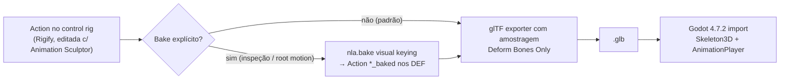

# Pipeline Blender → Godot

> Objetivo: animação feita com Animation Sculptor chega ao Godot como animação glTF comum. Nada de runtime próprio ([ADR 0009](../decisions/0009-export-native-bake-gltf.md)).

## Caminho

- O exportador glTF do Blender **amostra a pose avaliada** quando "Sampling" está ligado; com "Deform Bones Only" ele grava só os `DEF-*` já com constraints resolvidas. Isso já é um bake. O bake explícito (`nla.bake`, visual keying, só DEF) fica como opção para inspecionar no Blender e para preparar root motion.
- Nomes de opções do exportador a confirmar no 5.2 (lista em [blender-5.2-notes](../development/blender-5.2-notes.md)): `export_def_bones`, `export_animation_mode='ACTIONS'`, `export_force_sampling`, `export_frame_step`, `export_anim_slide_to_zero`, `export_optimize_animation_size`, `export_leaf_bone`, `export_hierarchy_flatten_bones`.

## Problemas conhecidos do Rigify em game engines (documentados pelo GameRig)

1. DEF bones **não formam uma hierarquia única** — o exportador reparenta para o ancestral deform mais próximo; pode haver várias raízes.
2. DEF bones **com escala** (stretch) — engines tratam escala de forma diferente.
3. **B-Bones** — viram bones rígidos no glTF; a deformação no Godot difere da do Blender.
4. `root` não é deform ⇒ sem trilha de root motion.

Política ([ADR 0009](../decisions/0009-export-native-bake-gltf.md)): **não construir conversor de esqueleto**. Suportar dois caminhos e validar ambos no teste final:

| Caminho | Quando | Ferramenta |
|---|---|---|
| Rigify padrão + Deform Only | prototipagem, personagem já existente | nativo; `pipeline/validate` avisa sobre 1–4 |
| Rig "game-ready" | produção | **GameRig** (feature set Rigify, GPL-2) ou **Rigodotify** (MIT, gera hierarquia compatível Godot/Unity/Unreal). Animation Sculptor é agnóstico: anima os controles do rig gerado. |

Compatibilidade de GameRig/Rigodotify com Blender 5.2 precisa ser verificada (ver [agenda](../agenda.md#investigação)).

## Root motion

Opção a decidir no Escopo 2: marcar `root` como deform (sem pesos) para que vire raiz do `Skeleton3D`, e no Godot usar `AnimationTree.root_motion_track = "Skeleton3D:root"`. Alternativa: extrair movimento horizontal dos hips para `root` antes do export (operação de bake). Rigodotify e GameRig já possuem `root` deform.

## Preset de export (Escopo 2: `pipeline/export_gltf.py`)

- GLB, seleção = rig + meshes do personagem.
- Animação: modo Actions, só Actions marcadas para export (prop na Action), sampling a cada frame, slide to zero.
- Deform Bones Only; sem leaf bones.
- Validação prévia (`pipeline/validate`): escala não uniforme em DEF, B-Bones com segmentos > 1, múltiplas raízes, F-Curves com modificadores não bakeados, Action vazia, range de frames.

## Validação no Godot

Teste determinístico de ponta a ponta (detalhes em [testing/godot-export-test.md](../testing/godot-export-test.md)):

1. Blender exporta o `.glb` **e** um JSON de referência com posições globais de alguns DEF bones (mãos, pés, hips, cabeça) em frames-chave.
2. Godot headless importa o `.glb` (`godot --headless --import`) e roda um script que amostra o `Skeleton3D` nos mesmos tempos.
3. Comparação com tolerância (conversão Z-up → Y-up). Falha se a animação não existe, tem duração errada, faltam bones, ou posições divergem.
