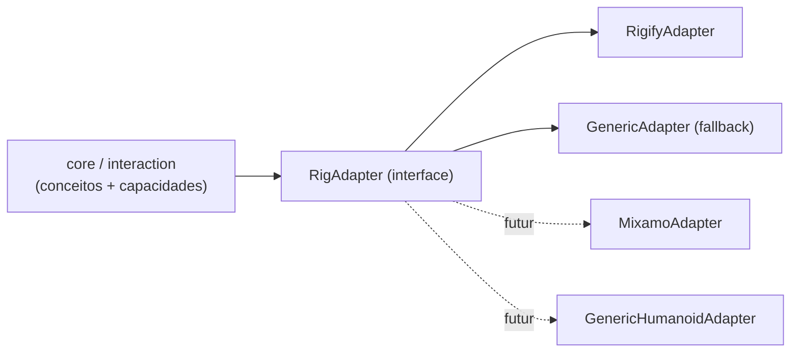

# Rig Adapter

> O core fala em conceitos anatômicos; o adapter traduz para o rig real. Rigify é o primeiro e único adapter oficial do MVP ([ADR 0002](../decisions/0002-rigify-first-rig-adapter.md)).

## Camadas



## Conceitos (`rig/concepts.py`)

`root, hips, torso, chest, neck, head, shoulder.{L,R}, upper_arm.{L,R}, forearm.{L,R}, hand.{L,R}, hand_ik.{L,R}, pole_arm.{L,R}, thigh.{L,R}, shin.{L,R}, foot.{L,R}, foot_ik.{L,R}, pole_leg.{L,R}`.

Conceitos FK (`upper_arm`, `forearm`, `hand`, …) e IK (`hand_ik`, `pole_arm`, …) são distintos: o adapter informa qual está ativo.

## Interface

Implementado em `animation_sculptor/rig/` (`concepts.py`, `adapter.py`, `generic.py`, `rigify.py`; sem `bpy` no nível de módulo, único pacote que conhece nomes de bones). `RigAdapter` é uma classe base; cada adapter é **uma instância por armature** (guarda o nome do objeto) e os métodos que olham o rig recebem o `arm_ob`:

```python
class RigAdapter:
    id: str                                   # "rigify", "generic"
    @classmethod
    def detect(cls, arm_ob) -> float          # confiança 0..1; maior vence
    def bone_for(self, concept) -> str | None
    def concept_for(self, bone_name) -> str | None
    def chain(self, concept) -> list[str]     # ex.: hand.L → [upper_arm_fk.L, forearm_fk.L, hand_fk.L]
    def ik_fk_state(self, arm_ob, limb) -> float | None   # limb = 'arm.L'/'leg.R'; 0 = IK, 1 = FK; None sem switch
    def is_control(self, bone_name) -> bool   # nunca editar MCH/ORG/DEF
    def translation_allowed(self, bone_name) -> bool      # veto de translação (cadeias FK)
    def deform_bones(self, arm_ob) -> list[str]
    def classify(self, arm_ob, bone_name) -> ControlInfo | None   # None = não é controle
    def controls(self, arm_ob) -> list[ControlInfo]       # bones animáveis + capacidades
    def ephemeral_chain(self, arm_ob, bone, scope) -> (list[str], str)   # cadeia do rig efêmero (raiz → bone) e motivo de recusa; scope TIP/LIMB/BODY
    def body_override(self, arm_ob, bone) -> bool          # no Corpo, arrastar a ponta deste controle gira o corpo mesmo se ele transla
    def ephemeral_pins(self, arm_ob, chain) -> (list[(str, list[str])], str)   # membros presos (pés) do Corpo
    def control_for_deform(self, arm_ob, deform_bone) -> (str, str, str)       # agarrar o corpo: (controle, CHAIN|IK, motivo)
    def ephemeral_aim(self, arm_ob, bone, scope) -> list[str]                    # bones apontados depois da cadeia (Rigify: neck[, head])

register_adapter(cls)      # decorator; registro na ordem de import
get_adapter(arm_ob)        # melhor `detect`; cache por (nome do objeto, nome dos dados, rig_id)
clear_cache()              # chamado no load_post (interaction/__init__.py)
```

Diferenças em relação ao rascunho inicial desta página: os métodos `ik_fk_state`, `deform_bones`, `classify` e `controls` recebem o `arm_ob` (o adapter não guarda referência ao objeto); `ik_fk_state` não recebe frame (lê o valor atual da propriedade); existe `translation_allowed`; `classify` devolve `None` para não-controles.

`ControlInfo` (dataclass congelada): `name`, `concept` (opcional), `capabilities` (`frozenset` de `TRANSLATION`/`ROTATION`), `free_axes` (eixos de `location` livres), `reference` (`HEAD` p/ translação, `TAIL` p/ FK) e as propriedades `translates`/`rotates`. Cor/grupo para UI não existem ainda.

Regras de `classify` (na base, valem para todos os adapters):
- Não controle (`is_control` falso ou bone inexistente) ⇒ `None`.
- **Bone conectado (`use_connect`) nunca transla**: o Blender ignora a `location` dele, então todos os eixos contam como travados.
- Eixos livres = `not lock_location`; `translation_allowed` falso zera os eixos.
- `TRANSLATION` se algum eixo livre; `ROTATION` se a rotação não está toda travada (considera o `lock_rotation_w` em quaternion/axis-angle).
- Na ferramenta: não controle ⇒ recusa "não é um controle do rig (MCH/ORG/DEF)"; controle sem `TRANSLATION` ⇒ "controle só de rotação: sculpt espacial de FK no Escopo 4 (use tempo: Ctrl+arrastar)". O painel mostra "Rig: <objeto> (<id do adapter>)" e o conceito + capacidades do bone ativo.

## RigifyAdapter

Detecção (implementada): armature com `data["rig_id"]` (gerada pelo Rigify); sem `root` e `torso` a confiança é 0,3; com eles, `0,5 + 0,5 × fração dos bones do mapa de conceitos que existem` (o genérico responde 0,1, então o Rigify vence sempre que há `rig_id`).

Mapa padrão (metarig "Human"). ✅ = confirmado em 2026-10-03 no rig Rigify do personagem de teste (`Vale_Rig_Animations.blend`, objeto `rig`, 410 bones, `rig_id = "cuyc5bv7a7800ba6"`, aberto no Blender 5.2.1) — ver [inspeção do rig de teste](#inspeção-do-rig-de-teste-2026-10-03):

| Conceito | Bone Rigify | Tipo | `rotation_mode` |
|---|---|---|---|
| root | `root` ✅ | translação + rotação | QUATERNION |
| torso | `torso` ✅ (pai `MCH-torso.parent`, prop `torso_parent`: None/Root) | translação + rotação | QUATERNION |
| hips | `hips` ✅ (filho de `torso`) | rotação | QUATERNION |
| chest | `chest` ✅ (filho de `torso`) | rotação | QUATERNION |
| neck / head | `neck`, `head` ✅ (pais `MCH-ROT-neck`/`MCH-ROT-head`; props `neck_follow`, `head_follow` em `torso`) | rotação | QUATERNION |
| shoulder.L | `shoulder.L` ✅ | rotação | **YXZ** |
| upper_arm.L / forearm.L / hand.L (FK) | `upper_arm_fk.L`, `forearm_fk.L`, `hand_fk.L` ✅ (`hand_fk` com location travada) | rotação | QUATERNION |
| hand_ik.L | `hand_ik.L` ✅ (pai `MCH-hand_ik.parent.L`) | translação + rotação | QUATERNION |
| pole_arm.L | `upper_arm_ik_target.L` ✅ (pai `MCH-upper_arm_ik_target.parent.L`) | translação | QUATERNION |
| thigh.L / shin.L / foot.L (FK) | `thigh_fk.L`, `shin_fk.L`, `foot_fk.L` ✅ (+ `toe_fk.L`; `foot_fk` com location travada) | rotação | QUATERNION |
| foot_ik.L | `foot_ik.L` ✅ (pai `MCH-foot_ik.parent.L`; filhos `foot_spin_ik.L` → `foot_heel_ik.L`; `toe_ik.L`) | translação + rotação | QUATERNION (`foot_heel_ik`: ZXY, location travada) |
| pole_leg.L | `thigh_ik_target.L` ✅ | translação | QUATERNION |
| switch IK/FK braço | prop `IK_FK` (float 0..1, **0 = IK, 1 = FK**) em `upper_arm_parent.L` ✅ | — | — |
| switch IK/FK perna | prop `IK_FK` em `thigh_parent.L` ✅ | — | — |
| parent do IK | prop `IK_parent` (int enum) no mesmo `*_parent` ✅: braço `None, Root, Torso, Hips, Chest, Head, shoulder.L`; perna `None, Root, Torso, Hips, Chest, Head`. Default/valor no rig: 1 = Root | — | — |
| parent do pole | prop `pole_parent` no mesmo `*_parent` ✅: braço `… , shoulder.L, hand_ik.L` (valor 6 = shoulder); perna `… , foot_ik.L` (valor 3 = Hips) | — | — |
| outras props | `IK_Stretch` (0..1), `FK_limb_follow` (0..1), `pole_vector` (bool) em `*_parent`; `rubber_tweak` nos tweaks | — | — |
| deform | `DEF-*` ✅ (73 bones) | — | — |

Classificação no Rigify: não são controles os bones com prefixo `ORG-`, `MCH-`, `DEF-`, `VIS_` ou `WGT-`; `deform_bones` = bones `DEF-*`; as cadeias (`chain`) são `hand.{L,R}` → upper_arm/forearm/hand FK e `foot.{L,R}` → thigh/shin/foot FK; o switch IK/FK de braço/perna é lido de `IK_FK` em `upper_arm_parent`/`thigh_parent`.

Achados da implementação (2026-10-03, rig gerado + personagem do mantenedor):
- **Cadeias FK são só de rotação por desenho, embora o Rigify deixe `location` destravada em `upper_arm_fk` e `thigh_fk`** (as raízes das cadeias; `forearm_fk`, `hand_fk` etc. já vêm travados). Mover essas raízes descola o membro do corpo e não é alvo de sculpt, então o `RigifyAdapter.translation_allowed` veta translação em todos os conceitos FK (`upper_arm`, `forearm`, `hand`, `thigh`, `shin`, `foot`), ignorando os locks. Sculpt espacial de FK fica para o Escopo 4.
- **O rig gerado tem ~114 drivers em propriedades de pose** (props do Rigify, constraints, etc.). Por isso a detecção de espaço constante em [`anim/spaces`](../architecture.md) não pode tratar "existe driver" como "não constante": a regra olha só os drivers/F-Curves que escrevem em ancestrais do bone (por nome do pose bone), além de constraints e animação do objeto.

Observações importantes do Rigify:
- ✅ Controles principais usam **`rotation_mode = 'QUATERNION'`**; exceções: `shoulder.*`/`breast.*` em `YXZ`, tweaks (`*_tweak*`, `tweak_spine*`), `upper_arm_ik.*`, `thigh_ik.*` e `foot_heel_ik.*` em `ZXY`. O adapter deve ler `rotation_mode` por bone, nunca assumir. Irrelevante para a Iteração 1 (só translação), crítico para FK sculpt (Escopo 4).
- O espaço de `location` de `hand_ik` depende do *IK parent* (constraint Armature num `MCH-` pai). `P(f)` cobre isso porque é medido no rig avaliado, frame a frame.
- Snapping IK↔FK: o Rigify gera operadores próprios no `rig_ui.py` (✅ `pose.rigify_limb_ik2fk_<rig_id>`, `pose.rigify_limb_ik2fk_bake_<rig_id>`, `pose.rigify_generic_snap_<rig_id>`, `pose.rigify_limb_toggle_pole_<rig_id>`…). Reutilizar em vez de escrever o nosso (Escopo 4). ⚠ `rig_ui.py` é um texto com auto-run: com auto-exec de scripts desligado (padrão; e sempre em `--factory-startup`) os operadores **não existem** — o adapter não pode depender deles sem checar.
- DEF bones do Rigify não formam hierarquia única, têm escala e B-Bones — problema de export, não de sculpt. Ver [godot-pipeline.md](godot-pipeline.md).

## Inspeção do rig de teste (2026-10-03)

Personagem do usuário (`Vale_Rig_Animations.blend`, local, não versionado), Blender 5.2.1:

- Objetos: `rig` (Rigify gerado, coleção `mesh`), `metarig` (oculto), `Armature` (rig auxiliar da saia, filho de `rig`/`hips`, oculto), `Vale_Sword_Rig` (armature da espada, **parent de bone em `hand_ik.R`**), meshes `Vale_*` (corpo com modificador Armature → `rig`; joelhos/ombros com parent de bone em tweaks; `Vale_skirt` deformado por `Armature`; `Vale_Knightblade_LowPoly` deformado por `Vale_Sword_Rig`), `Icosphere` (coleção `glTF_not_exported`), 132 widgets `WGT-rig_*` (coleção `WGTS_rig`, oculta).
- Personagem olha para **−Y**, ~1,8 m, `root` na origem, `rig.matrix_world` identidade.
- Coleções de bones: `Face`, `Face (Primary)`, `Face (Secondary)` (vazias — rig sem face), `Torso`, `Torso (Tweak)`, `Fingers`, `Fingers (Detail)`, `Arm.L/R (IK|FK|Tweak)`, `Leg.L/R (IK|FK|Tweak)`, `Root`, `ORG` (67), `MCH` (138), `DEF` (73). Visíveis por padrão: Torso, Torso (Tweak), Arm/Leg (IK), Root.
- Actions: `idle` (slot `OBrig`, 431 F-Curves, frames 1–48, BEZIER + CONSTANT nas props) e `Animation` (slot `OBVale_Sword_Rig`, vazia). A idle **não** é usada pelos testes.
- Detalhe para `P(f)`: o espaço de `location` dos poles depende de `pole_parent` (braço = shoulder, perna = hips), então os valores locais de `upper_arm_ik_target`/`thigh_ik_target` mudam quando o torso se move mesmo com a posição de mundo fixa — confirma que `P(f)` precisa ser medido no rig avaliado.

## GenericAdapter (fallback)

Implementado (`rig/generic.py`): confiança 0,1 para qualquer armature (portanto fallback). Herda toda a base: todo pose bone é controle; capacidades pelos locks (`location` livre e não conectado ⇒ translação; rotação livre ⇒ rotação); `deform_bones` = bones com `use_deform`; sem conceitos (`concept_for`/`bone_for` vazios). Garante que a Iteração 1 funcione em qualquer armature (e em objetos simples, para testes). Não distingue FK de IK nem mecanismos. `ephemeral_chain` (base): `TIP` = só o bone; `LIMB` = até 3 bones terminando no arrastado, subindo pela hierarquia enquanto o pai gira, é controle e tem **um único filho** (ramificação encerra o membro) — sem nomes, serve a esqueletos sem control rig (Mixamo). `BODY` = sobe atravessando ramificações (até 8 bones); `ephemeral_pins` (base) = filhos de cadeia única da raiz da cadeia (pernas sob o `Hips`); `body_override` (base) = qualquer controle que gira.

**Esqueleto simples ([ADR 0014](../decisions/0014-skeleton-first.md), fluxo principal desde a 0.8.0)**: o esqueleto de `scripts/make_basic_rig.py` é atendido só pelo genérico, sem nomes: `root` com rotação travada (só translada), `hips` translada e gira, o resto só gira (`lock_location`). Resultado medido (`tests/blender/test_simple_skeleton.py`): `Membro` na mão = `upper_arm → forearm → hand` (limite de 3 bones); no dedo = as três falanges; `Corpo` na cabeça = `hips → spine → spine.001 → chest → neck → head`, com as coxas como pinos.

No Rigify, `ephemeral_chain` vem do mapa de conceitos (FK `upper_arm → forearm → hand`, `thigh → shin → foot`), porque `hand_fk`/`foot_fk` são filhos de helpers `MCH-*_fk` e a caminhada pela hierarquia pararia ali; membro com `IK_FK < 0,5` é recusado ("membro em IK: arraste a mão IK ou mude o membro para FK"); controles de rotação que não são de membro (cabeça, pescoço, tórax, ombro…) usam `TIP`. `BODY`: `chest` → `torso, chest`; `hips` → `torso, hips`; `neck`/`head` → `torso, chest, neck(, head)` (recusado pela checagem de rigidez: Neck/Head Follow); `body_override` só para `hips`/`chest`/`neck`/`head`; `ephemeral_pins` = pernas em FK (`thigh_fk → shin_fk → foot_fk`), presas ao `torso`.

## Regras

1. O core nunca contém literal de nome de bone. Teste estático em `scripts/checks.py` procura por `"DEF-"`, `"_fk."`, `"_ik."` fora de `rig/`.
2. Adapter não escreve animação; só responde perguntas.
3. Adapter é escolhido por armature e cacheado por (objeto, dados, `rig_id`); invalidado em `load_post` (`rig.clear_cache()`).

## Testes

`tests/unit/test_rig.py` (11, com armatures falsos, sem Blender): Rigify detectado sobre o genérico, genérico para armature simples, confiança baixa sem `root`/`torso`, ida e volta conceito ⇄ bone, não controles nunca editados, capacidades pelos locks, `IK_FK` e cadeias, `deform_bones`, cache por armature, cadeias FK só de rotação mesmo com `location` livre, bone conectado nunca transla. `tests/blender/test_rig_adapter.py` (4): adapter Rigify no rig gerado (CI) e no personagem (local), genérico em armature simples, recusas do gesto (FK e MCH). Ver [blender-tests](../testing/blender-tests.md).

## Auditoria

O que ainda vaza do Rigify para as ferramentas (o tipo `IK`, `ik_fk_state` na base) e o plano para tirar: [rig-independence-audit.md](rig-independence-audit.md).
