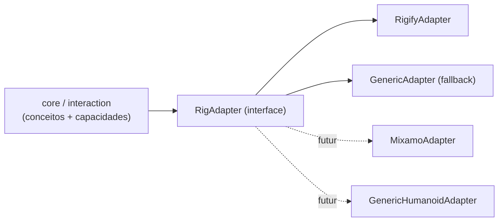

# Rig Adapter

> O core fala em conceitos anatômicos; o adapter traduz para o rig real. Rigify é o primeiro e único adapter oficial do MVP ([ADR 0002](../decisions/0002-rigify-first-rig-adapter.md)).

## Camadas



## Conceitos (`rig/concepts.py`)

`root, hips, torso, chest, neck, head, shoulder.{L,R}, upper_arm.{L,R}, forearm.{L,R}, hand.{L,R}, hand_ik.{L,R}, pole_arm.{L,R}, thigh.{L,R}, shin.{L,R}, foot.{L,R}, foot_ik.{L,R}, pole_leg.{L,R}`.

Conceitos FK (`upper_arm`, `forearm`, `hand`, …) e IK (`hand_ik`, `pole_arm`, …) são distintos: o adapter informa qual está ativo.

## Interface

```python
class RigAdapter(Protocol):
    id: str                                   # "rigify", "generic"
    @classmethod
    def detect(cls, arm_ob) -> float          # confiança 0..1; maior vence
    def bone_for(self, concept) -> str | None
    def concept_for(self, bone_name) -> str | None
    def controls(self) -> list[ControlInfo]   # bones animáveis + capacidades
    def classify(self, bone_name) -> ControlInfo   # TRANSLATION / ROTATION / ambos, ponto de referência
    def chain(self, concept) -> list[str]     # ex.: hand.L → [upper_arm_fk.L, forearm_fk.L, hand_fk.L]
    def ik_fk_state(self, limb, frame) -> float   # 0 = IK, 1 = FK (convertido para esta convenção)
    def deform_bones(self) -> list[str]
    def is_control(self, bone_name) -> bool   # nunca editar MCH/ORG/DEF
```

`ControlInfo`: nome, conceito (opcional), capacidades, eixos livres, ponto de referência sugerido (`HEAD` p/ translação, `TAIL` p/ FK), cor/grupo para UI.

## RigifyAdapter

Detecção: armature com propriedade `rig_id` nos dados (gerada pelo Rigify) e bones `root`, `torso`. Confiança alta só se os nomes esperados existirem.

Mapa padrão (metarig "Human"). ✅ = confirmado em 2026-10-03 no rig Rigify do personagem de teste (`Vale_Rig_Animations.blend`, objeto `rig`, 410 bones, `rig_id = "cuyc5bv7a7800ba6"`, aberto no Blender 5.2.1) — ver [inspeção do rig de teste](#inspeção-do-rig-de-teste-2026-10-03):

| Conceito | Bone Rigify | Tipo | `rotation_mode` |
|---|---|---|---|
| root | `root` ✅ | translação + rotação | QUATERNION |
| torso | `torso` ✅ (pai `MCH-torso.parent`, prop `torso_parent`: None/Root) | translação + rotação | QUATERNION |
| hips | `hips` ✅ (filho de `torso`) | rotação | QUATERNION |
| chest | `chest` ✅ (filho de `torso`) | rotação | QUATERNION |
| neck / head | `neck`, `head` ✅ (pais `MCH-ROT-neck`/`MCH-ROT-head`; props `neck_follow`, `head_follow` em `torso`) | rotação | QUATERNION |
| shoulder.L | `shoulder.L` ✅ | rotação | **YXZ** |
| upper_arm.L / forearm.L / hand.L (FK) | `upper_arm_fk.L`, `forearm_fk.L`, `hand_fk.L` ✅ (`hand_fk` com location travada) | rotação | QUATERNION |
| hand_ik.L | `hand_ik.L` ✅ (pai `MCH-hand_ik.parent.L`) | translação + rotação | QUATERNION |
| pole_arm.L | `upper_arm_ik_target.L` ✅ (pai `MCH-upper_arm_ik_target.parent.L`) | translação | QUATERNION |
| thigh.L / shin.L / foot.L (FK) | `thigh_fk.L`, `shin_fk.L`, `foot_fk.L` ✅ (+ `toe_fk.L`; `foot_fk` com location travada) | rotação | QUATERNION |
| foot_ik.L | `foot_ik.L` ✅ (pai `MCH-foot_ik.parent.L`; filhos `foot_spin_ik.L` → `foot_heel_ik.L`; `toe_ik.L`) | translação + rotação | QUATERNION (`foot_heel_ik`: ZXY, location travada) |
| pole_leg.L | `thigh_ik_target.L` ✅ | translação | QUATERNION |
| switch IK/FK braço | prop `IK_FK` (float 0..1, **0 = IK, 1 = FK**) em `upper_arm_parent.L` ✅ | — | — |
| switch IK/FK perna | prop `IK_FK` em `thigh_parent.L` ✅ | — | — |
| parent do IK | prop `IK_parent` (int enum) no mesmo `*_parent` ✅: braço `None, Root, Torso, Hips, Chest, Head, shoulder.L`; perna `None, Root, Torso, Hips, Chest, Head`. Default/valor no rig: 1 = Root | — | — |
| parent do pole | prop `pole_parent` no mesmo `*_parent` ✅: braço `… , shoulder.L, hand_ik.L` (valor 6 = shoulder); perna `… , foot_ik.L` (valor 3 = Hips) | — | — |
| outras props | `IK_Stretch` (0..1), `FK_limb_follow` (0..1), `pole_vector` (bool) em `*_parent`; `rubber_tweak` nos tweaks | — | — |
| deform | `DEF-*` ✅ (73 bones) | — | — |

Observações importantes do Rigify:
- ✅ Controles principais usam **`rotation_mode = 'QUATERNION'`**; exceções: `shoulder.*`/`breast.*` em `YXZ`, tweaks (`*_tweak*`, `tweak_spine*`), `upper_arm_ik.*`, `thigh_ik.*` e `foot_heel_ik.*` em `ZXY`. O adapter deve ler `rotation_mode` por bone, nunca assumir. Irrelevante para a Iteração 1 (só translação), crítico para FK sculpt (Escopo 4).
- O espaço de `location` de `hand_ik` depende do *IK parent* (constraint Armature num `MCH-` pai). `P(f)` cobre isso porque é medido no rig avaliado, frame a frame.
- Snapping IK↔FK: o Rigify gera operadores próprios no `rig_ui.py` (✅ `pose.rigify_limb_ik2fk_<rig_id>`, `pose.rigify_limb_ik2fk_bake_<rig_id>`, `pose.rigify_generic_snap_<rig_id>`, `pose.rigify_limb_toggle_pole_<rig_id>`…). Reutilizar em vez de escrever o nosso (Escopo 4). ⚠ `rig_ui.py` é um texto com auto-run: com auto-exec de scripts desligado (padrão; e sempre em `--factory-startup`) os operadores **não existem** — o adapter não pode depender deles sem checar.
- DEF bones do Rigify não formam hierarquia única, têm escala e B-Bones — problema de export, não de sculpt. Ver [godot-pipeline.md](godot-pipeline.md).

## Inspeção do rig de teste (2026-10-03)

Personagem do usuário (`Vale_Rig_Animations.blend`, local, não versionado), Blender 5.2.1:

- Objetos: `rig` (Rigify gerado, coleção `mesh`), `metarig` (oculto), `Armature` (rig auxiliar da saia, filho de `rig`/`hips`, oculto), `Vale_Sword_Rig` (armature da espada, **parent de bone em `hand_ik.R`**), meshes `Vale_*` (corpo com modificador Armature → `rig`; joelhos/ombros com parent de bone em tweaks; `Vale_skirt` deformado por `Armature`; `Vale_Knightblade_LowPoly` deformado por `Vale_Sword_Rig`), `Icosphere` (coleção `glTF_not_exported`), 132 widgets `WGT-rig_*` (coleção `WGTS_rig`, oculta).
- Personagem olha para **−Y**, ~1,8 m, `root` na origem, `rig.matrix_world` identidade.
- Coleções de bones: `Face`, `Face (Primary)`, `Face (Secondary)` (vazias — rig sem face), `Torso`, `Torso (Tweak)`, `Fingers`, `Fingers (Detail)`, `Arm.L/R (IK|FK|Tweak)`, `Leg.L/R (IK|FK|Tweak)`, `Root`, `ORG` (67), `MCH` (138), `DEF` (73). Visíveis por padrão: Torso, Torso (Tweak), Arm/Leg (IK), Root.
- Actions: `idle` (slot `OBrig`, 431 F-Curves, frames 1–48, BEZIER + CONSTANT nas props) e `Animation` (slot `OBVale_Sword_Rig`, vazia). A idle **não** é usada pelos testes.
- Detalhe para `P(f)`: o espaço de `location` dos poles depende de `pole_parent` (braço = shoulder, perna = hips), então os valores locais de `upper_arm_ik_target`/`thigh_ik_target` mudam quando o torso se move mesmo com a posição de mundo fixa — confirma que `P(f)` precisa ser medido no rig avaliado.

## GenericAdapter (fallback)

Sempre disponível com confiança baixa. Qualquer pose bone com F-Curve ou canal livre de `location` é controle de translação; bones com rotação livre são controles de rotação; `deform_bones` = bones com `use_deform`. Sem conceitos. Garante que a Iteração 1 funcione em qualquer armature (e em objetos simples, para testes).

## Regras

1. O core nunca contém literal de nome de bone. Teste estático em `scripts/dev.py validate` procura por `"DEF-"`, `"_fk."`, `"_ik."` fora de `rig/`.
2. Adapter não escreve animação; só responde perguntas.
3. Adapter é escolhido por armature e cacheado; invalidado em `load_post`/troca de rig.
