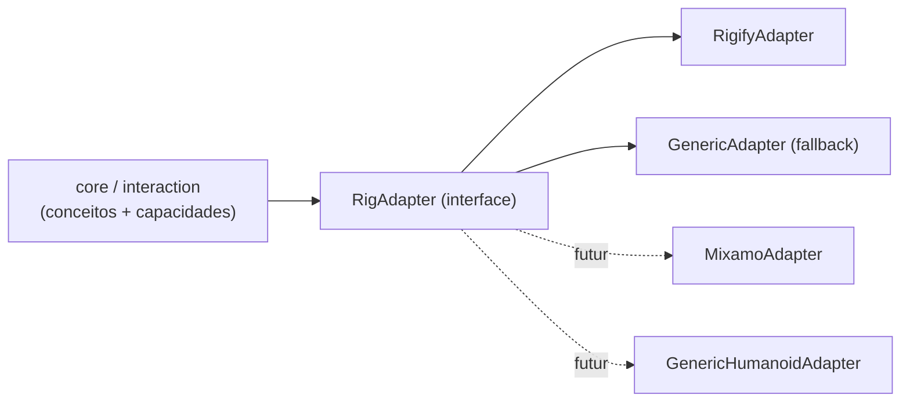

# Rig Adapter

> O core fala em conceitos anatômicos; o adapter traduz para o rig real. Rigify é o primeiro e único adapter oficial do MVP ([ADR 0002](../decisions/0002-rigify-first-rig-adapter.md)).

## Camadas



## Conceitos (`rig/concepts.py`)

`root, hips, torso, chest, neck, head, shoulder.{L,R}, upper_arm.{L,R}, forearm.{L,R}, hand.{L,R}, hand_ik.{L,R}, pole_arm.{L,R}, thigh.{L,R}, shin.{L,R}, foot.{L,R}, foot_ik.{L,R}, pole_leg.{L,R}`.

Conceitos FK (`upper_arm`, `forearm`, `hand`, …) e IK (`hand_ik`, `pole_arm`, …) são distintos: o adapter informa qual está ativo.

## Interface

```python
class RigAdapter(Protocol):
    id: str                                   # "rigify", "generic"
    @classmethod
    def detect(cls, arm_ob) -> float          # confiança 0..1; maior vence
    def bone_for(self, concept) -> str | None
    def concept_for(self, bone_name) -> str | None
    def controls(self) -> list[ControlInfo]   # bones animáveis + capacidades
    def classify(self, bone_name) -> ControlInfo   # TRANSLATION / ROTATION / ambos, ponto de referência
    def chain(self, concept) -> list[str]     # ex.: hand.L → [upper_arm_fk.L, forearm_fk.L, hand_fk.L]
    def ik_fk_state(self, limb, frame) -> float   # 0 = IK, 1 = FK (convertido para esta convenção)
    def deform_bones(self) -> list[str]
    def is_control(self, bone_name) -> bool   # nunca editar MCH/ORG/DEF
```

`ControlInfo`: nome, conceito (opcional), capacidades, eixos livres, ponto de referência sugerido (`HEAD` p/ translação, `TAIL` p/ FK), cor/grupo para UI.

## RigifyAdapter

Detecção: armature com propriedade `rig_id` nos dados (gerada pelo Rigify) e bones `root`, `torso`. Confiança alta só se os nomes esperados existirem.

Mapa padrão (metarig "Human", Rigify do Blender 5.2 — **validar contra rig gerado no primeiro teste de integração**):

| Conceito | Bone Rigify | Tipo |
|---|---|---|
| root | `root` | translação + rotação |
| torso | `torso` | translação + rotação |
| hips | `hips` | rotação |
| chest | `chest` | rotação |
| neck / head | `neck`, `head` | rotação |
| shoulder.L | `shoulder.L` | rotação |
| upper_arm.L / forearm.L / hand.L (FK) | `upper_arm_fk.L`, `forearm_fk.L`, `hand_fk.L` | rotação |
| hand_ik.L | `hand_ik.L` | translação + rotação |
| pole_arm.L | `upper_arm_ik_target.L` | translação |
| thigh.L / shin.L / foot.L (FK) | `thigh_fk.L`, `shin_fk.L`, `foot_fk.L` | rotação |
| foot_ik.L | `foot_ik.L` | translação + rotação |
| pole_leg.L | `thigh_ik_target.L` | translação |
| switch IK/FK braço | prop `IK_FK` em `upper_arm_parent.L` | — |
| switch IK/FK perna | prop `IK_FK` em `thigh_parent.L` | — |
| parent do IK | prop `IK_parent` no mesmo bone `*_parent` | — |
| deform | `DEF-*` | — |

Observações importantes do Rigify:
- Controles usam **`rotation_mode = 'QUATERNION'`** por padrão. Irrelevante para a Iteração 1 (só translação), crítico para FK sculpt (Escopo 4).
- O espaço de `location` de `hand_ik` depende do *IK parent* (constraint Armature num `MCH-` pai). `P(f)` cobre isso porque é medido no rig avaliado, frame a frame.
- Snapping IK↔FK: o Rigify gera operadores próprios no `rig_ui` (snap e "bake" de snap). Reutilizar em vez de escrever o nosso (Escopo 4).
- DEF bones do Rigify não formam hierarquia única, têm escala e B-Bones — problema de export, não de sculpt. Ver [godot-pipeline.md](godot-pipeline.md).

## GenericAdapter (fallback)

Sempre disponível com confiança baixa. Qualquer pose bone com F-Curve ou canal livre de `location` é controle de translação; bones com rotação livre são controles de rotação; `deform_bones` = bones com `use_deform`. Sem conceitos. Garante que a Iteração 1 funcione em qualquer armature (e em objetos simples, para testes).

## Regras

1. O core nunca contém literal de nome de bone. Teste estático em `scripts/dev.py validate` procura por `"DEF-"`, `"_fk."`, `"_ik."` fora de `rig/`.
2. Adapter não escreve animação; só responde perguntas.
3. Adapter é escolhido por armature e cacheado; invalidado em `load_post`/troca de rig.
