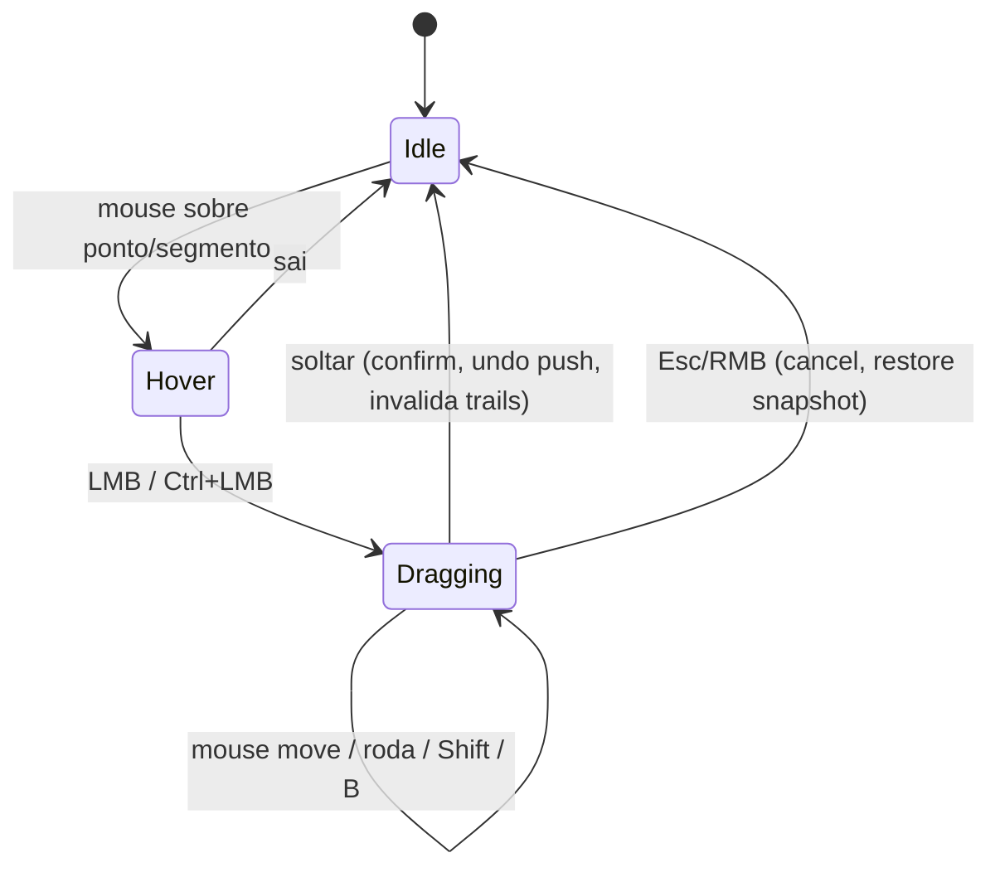

# Interação no viewport (UX)

> Animation Sculptor é uma ferramenta visual: UX faz parte do escopo desde a Iteração 1. Objetivo: o animador raramente precisa abrir o Graph Editor (que continua funcionando normalmente sobre as mesmas F-Curves).

## Entrada na ferramenta

- **Tool** no toolbar do 3D View em Pose Mode: "Animation Sculptor" (`WorkSpaceTool`). Ativa as trails dos controles selecionados/fixados e o overlay de sculpt.
- Fora da tool, as trails do LMP continuam disponíveis só como visualização (painel N › Animation Sculptor).
- Implementação ([ADR 0010](../decisions/0010-tool-gizmo-modal-interaction.md)): hover/picking via `Gizmo` customizado (`test_select`), gesto de arrasto via operador modal (um passo de undo por gesto). Fallback, se a API de gizmo limitar: modal de longa duração com `PASS_THROUGH` (padrão Motion Trail).

## Mapa de gestos (padrão — "sem Ctrl = espaço, Ctrl = tempo")

| Gesto | Onde | Ação |
|---|---|---|
| Hover | qualquer ponto/segmento | realce + tooltip no header (frame, tipo de ponto, controle) |
| Clique | ponto | seleciona o ponto e vai para o frame dele (configurável) |
| LMB arrastar | key point | **Grab** (soft, raio na roda do mouse ou `[`/`]`) |
| LMB arrastar | sampled point | **Arc drag** (resolve handles do segmento) |
| Ctrl+LMB arrastar | key point | **Retime** da pose key |
| Ctrl+LMB arrastar | segmento | **Spacing** (horizontal = favor, vertical = ease) |
| Shift (segurando) | durante gesto | precisão ×0.1 |
| `B` | durante arc drag | alterna "quebrar tangente" (`FREE`) |
| Esc / RMB | durante gesto | cancela (restaura snapshot) |
| soltar / Enter | durante gesto | confirma (1 passo de undo) |
| Ctrl+Z | — | undo normal do Blender |

Teclas evitam `Alt+LMB` (conflita com "Emulate 3 Button Mouse"). Keymap editável em Preferences › Keymap (registrado em `addon` keyconfig).

## Linguagem visual

| Elemento | Representação |
|---|---|
| Trail inativa | linha fina, alfa baixo, cor passado/futuro do LMP |
| Trail ativa (controle ativo) | linha mais grossa, alfa total |
| Key point | losango, maior; preenchido se selecionado |
| Sampled point | ponto pequeno; espaçamento entre pontos = spacing |
| Frame atual | marcador destacado que acompanha o controle ao vivo (já existe no LMP) |
| Hover | anel ao redor do ponto / segmento realçado |
| Range selecionado | trecho da trail em cor de seleção (Escopo 2) |
| Falloff (soft grab) | pontos afetados tingidos pelo peso; raio em frames no header |
| Preview do gesto | trail original "fantasma" (alfa baixo) + trail prevista em destaque |
| Velocidade | modo de cor *Speed* do LMP (heat-map lento→rápido) — principal leitura de spacing |
| Recusa | ponto/segmento em vermelho + motivo no header ("segmento LINEAR", "canal com driver", "NLA ativa") |

Header da área (`area.header_text_set`) durante o gesto: operação, valores (Δ em metros/frames, raio, favor/ease) e atalhos disponíveis.

## Estados

Durante `Dragging`: engine do LMP suspenso (sem frame stepping concorrente), preview analítico desenhado pelo overlay.

## Playback e performance percebida

- Playback: overlay de sculpt some; trails seguem a configuração do LMP ("Hide During Playback").
- Feedback a cada mouse move deve custar < 16 ms para um controle com ~200 frames (orçamento a medir; ver [testing/strategy.md](../testing/strategy.md#profiling)).

## Fora do escopo da Iteração 1 (planejado)

Seleção múltipla de pontos com box select, ranges, pins visíveis, tangent handles 3D, restrição a eixo (X/Y/Z) durante grab, pie menu de ferramentas, edição de trail de vários controles ao mesmo tempo.
