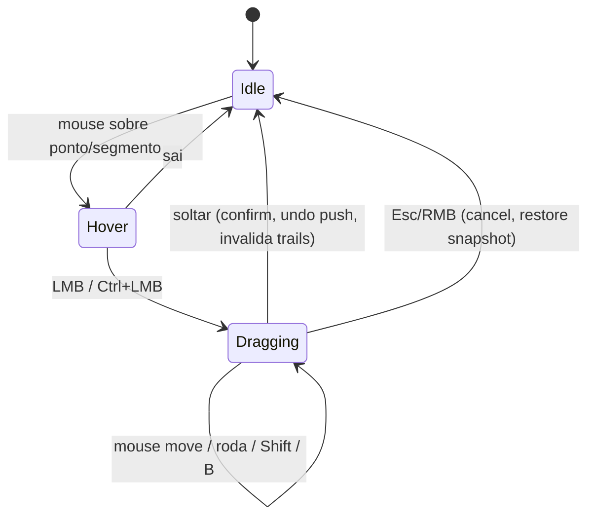

# Interação no viewport (UX)

> Animation Sculptor é uma ferramenta visual: UX faz parte do escopo desde a Iteração 1. Objetivo: o animador raramente precisa abrir o Graph Editor (que continua funcionando normalmente sobre as mesmas F-Curves).

## Entrada na ferramenta

- **Tool** no toolbar do 3D View em Pose Mode: "Animation Sculptor" (`WorkSpaceTool`). Ativa as trails dos controles selecionados/fixados e o overlay de sculpt.
- Fora da tool, as trails do LMP continuam disponíveis só como visualização (painel N › Animation Sculptor).
- Implementação ([ADR 0010](../decisions/0010-tool-gizmo-modal-interaction.md)): hover/picking via `Gizmo` customizado (`test_select`), gesto de arrasto via operador modal (um passo de undo por gesto). Fallback, se a API de gizmo limitar: modal de longa duração com `PASS_THROUGH` (padrão Motion Trail).

## Mapa de gestos (padrão — "sem Ctrl = espaço, Ctrl = tempo")

| Gesto | Onde | Ação |
|---|---|---|
| Hover | qualquer ponto/segmento | realce + tooltip no header (frame, tipo de ponto, controle) |
| Clique | ponto | seleciona o ponto e vai para o frame dele (configurável) |
| LMB arrastar | key point | **Grab** (soft: roda do mouse ou `[`/`]` mudam o raio em frames durante o gesto; raio 0 = só o ponto; vizinhas nunca são criadas) |
| LMB arrastar | sampled point | **Arc drag** (resolve os handles do segmento; keys e timing intactos) |
| Ctrl+LMB arrastar | key point | **Retime** da pose key (**implementado**: ao longo da trail; frames inteiros; Shift = sub-frame e precisão) |
| Ctrl+LMB arrastar | segmento (in-between) | **Spacing** (**implementado**: horizontal = favor, vertical = ease, 250 px por 1,0) |
| Shift (segurando) | durante gesto | precisão ×0.1 |
| Roda / `[` `]` | durante grab | raio do soft grab (frames); lembrado na sessão |
| `B` | durante arc drag | alterna "quebrar tangente" (`FREE`); começa desligado |
| Esc / RMB | durante gesto | cancela (restaura snapshot) |
| soltar / Enter | durante gesto | confirma (1 passo de undo) |
| Ctrl+Z | — | undo normal do Blender |

Teclas evitam `Alt+LMB` (conflita com "Emulate 3 Button Mouse"). Keymap editável em Preferences › Keymap (registrado em `addon` keyconfig).

## Linguagem visual

| Elemento | Representação |
|---|---|
| Trail inativa | linha fina, alfa baixo, cor passado/futuro do LMP |
| Trail ativa (controle ativo) | linha mais grossa, alfa total |
| Key point | losango, maior; preenchido se selecionado |
| Sampled point | ponto pequeno; espaçamento entre pontos = spacing |
| Frame atual | marcador destacado que acompanha o controle ao vivo (já existe no LMP) |
| Hover | anel ao redor do ponto / segmento realçado |
| Range selecionado | trecho da trail em cor de seleção (Escopo 2) |
| Falloff (soft grab) | **implementado**: anéis laranja nos pontos de key afetados, tamanho e alfa proporcionais ao peso; raio e nº de keys vizinhas no header |
| Preview do gesto | trail original "fantasma" (alfa baixo) + trail prevista em destaque |
| Velocidade | modo de cor *Speed* do LMP (heat-map lento→rápido) — principal leitura de spacing. **Implementado** no preview do spacing: pontos da trail prevista coloridos azul → vermelho pela distância por frame (normalizada pelo percentil 95); a trail normal segue o modo de cor configurado no LMP |
| Rótulo do gesto | **implementado**: texto ao lado do ponto arrastado, `16 → 17` no retime e `saída 75% · chegada 2%` no spacing |
| Recusa | **implementado**: anel vermelho no ponto recusado + "Animation Sculptor · recusado: <motivo>" no header ("segmento LINEAR", "canal com driver", "NLA ativa", "controle só de rotação…") + warning report; some quando o hover vai para outro ponto. Segmento em vermelho: planejado |

Header da área (`area.header_text_set`) durante o gesto: operação, valores (Δ em metros/frames, raio, favor/ease) e atalhos disponíveis. Como implementado:

- Grab: `Grab <bone> @ <frame>   Δ…   raio <r> frames (<n> key(s) vizinha(s)) · roda/[ ]: raio   Shift: precisão · Esc/RMB: cancelar · soltar: confirmar`.
- Arco: `Arco <bone> @ <frame>   Δ…   B: quebrar tangente [on|off]` e, quando algum eixo não pode ser editado, ` · eixos recusados: X, Y…`, seguido dos mesmos atalhos.
- Recusa: `Animation Sculptor · recusado: <motivo>`.
- Retime: `Retime da pose 16 → 17   N canal(is) · character entre 10 e 18   (arraste ao longo da trail; Shift: sub-frame)` seguido dos atalhos (`entre a e b` = limites das pose keys vizinhas; o escopo aparece como `character`/`selected`). A cena segue o novo frame, então a pose fica visível durante o arrasto.
- Spacing: `Spacing 10→16   saída 75% · chegada 2%   N canal(is) · preservar caminho   (horizontal: favorecer · vertical: ease)` seguido dos atalhos (`preservar suavidade` com a outra política).
- LMB num key point = grab e num in-between = arc; Ctrl+LMB num key point = retime e num in-between = spacing. Ctrl+LMB recusa com o motivo (sem Action, NLA, influence/blend, nenhuma key nesse frame, segmento LINEAR/CONSTANT, fora do intervalo de keys), como os gestos espaciais.
- Os gestos de tempo valem para qualquer controle, FK incluído (só tempo; o sculpt espacial de FK é do Escopo 4). Um passo de undo por gesto; Esc/RMB restaura bit a bit (e devolve a cena ao frame original no retime); ao soltar todas as trails são recalculadas (o gesto de tempo muda todos os canais do escopo). Ctrl/Alt/tecla de OS segurados durante o gesto não o encerram (qualquer outra tecla ainda confirma e é repassada).
- Escopo de timing (`CHARACTER`/`SELECTED`) e política de spacing são, por enquanto, configurações de sessão (`interaction/state.SETTINGS`); a UI vem no PR de painel/preferências/keymap.

## Estados

Durante `Dragging`: engine do LMP suspenso (sem frame stepping concorrente), preview analítico desenhado pelo overlay.

## Playback e performance percebida

- Playback: overlay de sculpt some; trails seguem a configuração do LMP ("Hide During Playback").
- Feedback a cada mouse move deve custar < 16 ms para um controle com ~200 frames (orçamento a medir; ver [testing/strategy.md](../testing/strategy.md#profiling)).

## Fora do escopo da Iteração 1 (planejado)

Seleção múltipla de pontos com box select, ranges, pins visíveis, tangent handles 3D, restrição a eixo (X/Y/Z) durante grab, pie menu de ferramentas, edição de trail de vários controles ao mesmo tempo.
