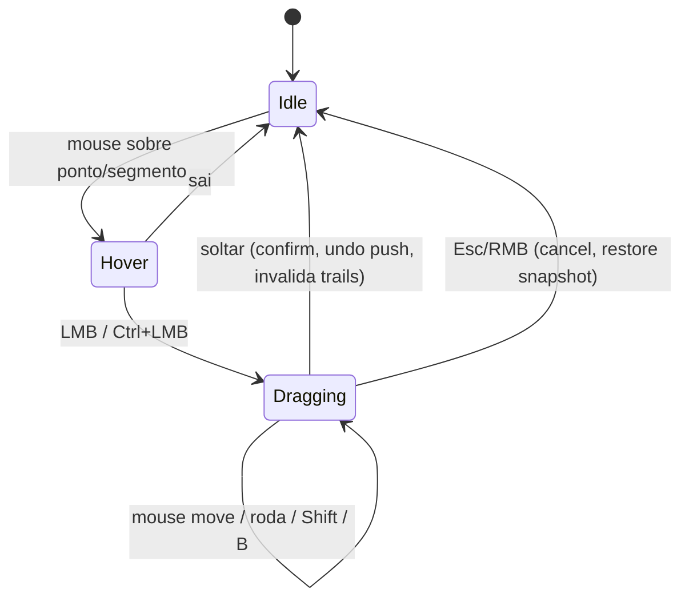

# Interação no viewport (UX)

> **Reforma de UX implementada na 0.7.0** ([ADR 0013](../decisions/0013-body-and-trail-interaction.md), [sculpt-ux.md](sculpt-ux.md)): modos **Corpo** (padrão: agarrar a malha, realce azul, pose/arco no frame atual) e **Trail** (os gestos abaixo); ferramentas **Ponta / Membro / Corpo / Smooth** na barra lateral (o escopo vem da ferramenta); painel N com o modo e os toggles (Trails, Ligar Rigify, Onion skin, Onion expandida) e os parâmetros fechados; régua v2; onion normal/expandido. O mapa de gestos abaixo é o do **modo Trail**; o modo Corpo está em sculpt-ux.md.

> Animation Sculptor é uma ferramenta visual: UX faz parte do escopo desde a Iteração 1. Objetivo: o animador raramente precisa abrir o Graph Editor (que continua funcionando normalmente sobre as mesmas F-Curves).

## Entrada na ferramenta

- **Tool** no toolbar do 3D View em Pose Mode: "Animation Sculptor" (`WorkSpaceTool`). Ativa as trails dos controles selecionados/fixados e o overlay de sculpt.
- Fora da tool, as trails do LMP continuam disponíveis só como visualização (painel N › Animation Sculptor).
- Implementação ([ADR 0010](../decisions/0010-tool-gizmo-modal-interaction.md)): hover/picking via `Gizmo` customizado (`test_select`), gesto de arrasto via operador modal (um passo de undo por gesto). Fallback, se a API de gizmo limitar: modal de longa duração com `PASS_THROUGH` (padrão Motion Trail).

## Mapa de gestos (padrão — "sem Ctrl = espaço, Ctrl = tempo")

| Gesto | Onde | Ação |
|---|---|---|
| Hover | qualquer ponto/segmento | realce + tooltip no header (frame, tipo de ponto, controle) |
| Clique | ponto | seleciona o ponto e vai para o frame dele (configurável) |
| LMB arrastar | key point | **Grab** (soft: roda do mouse ou `[`/`]` mudam o raio em frames durante o gesto; raio 0 = só o ponto; vizinhas nunca são criadas) |
| LMB arrastar | sampled point | **Arc drag** (resolve os handles do segmento; keys e timing intactos) |
| LMB arrastar | qualquer ponto da trail de um **controle só de rotação** (FK) | **Gesto efêmero** (0.5.0): gira a cadeia (`Membro`: braço/perna até o bone; `Ponta`: só ele) para a ponta seguir o mouse em todo frame da janela da régua, com falloff; grava keys em todo frame da janela (rotação), nada fora dela muda; mão/pé mantém a orientação `Mundo` (padrão) ou `Local`; roda/`[ ]` mudam a janela; membro em IK, `AXIS_ANGLE` e bone com constraint recusam com motivo |
| LMB arrastar | **ponta (tail) de um bone selecionado**, no frame atual, sem ponto de trail por perto | mesmo gesto efêmero, sem mirar na trail (0.6.0); no escopo `Corpo` também a ponta de `chest`/`hips`/`neck`/`head` (Rigify) ou de qualquer bone (genérico): a coluna gira e as pernas FK ficam com os pés presos |
| Clique sem arrastar | ponto/ponta | não escreve nada (0.6.0) |
| Ctrl+LMB arrastar | key point | **Retime** da pose key (**implementado**: ao longo da trail; frames inteiros; Shift = sub-frame e precisão) |
| Ctrl+LMB arrastar | segmento (in-between) | **Spacing** (**implementado**: horizontal = favor, vertical = ease, 250 px por 1,0) |
| Shift (segurando) | durante gesto | precisão ×0.1 |
| Roda / `[` `]` | durante grab | raio do soft grab (frames): os dois lados pelo mesmo passo; gravado em `Scene.asc_sculpt.radius_past`/`radius_future` (salvo no arquivo) |
| LMB arrastar | ponta da régua de tempo | raio do **passado** (ponta vermelha) ou do **futuro** (ponta verde) do soft grab, em frames inteiros (`asc.time_window`; 1 passo de undo; Esc/RMB cancela) |
| Shift+LMB arrastar | ponta da régua | os dois raios juntos |
| `B` | durante arc drag | alterna "quebrar tangente" (`FREE`); começa desligado |
| Esc / RMB | durante gesto | cancela (restaura snapshot) |
| soltar / Enter | durante gesto | confirma (1 passo de undo) |
| Ctrl+Z | — | undo normal do Blender |

Teclas evitam `Alt+LMB` (conflita com "Emulate 3 Button Mouse").

## Keymap

- **Ativar a ferramenta: `Shift+Alt+K`** em Pose Mode (`wm.tool_set_by_id`, `name="animation_sculptor.sculpt"`), no keyconfig `addon`, keymap **"Pose"**. Conferido livre no keymap padrão do 5.2 (nenhum item usa Shift+Alt+K). Editável em Preferences › Keymap (buscar "Animation Sculptor" ou `tool_set_by_id`, dentro de Pose).
- **Keymap da própria ferramenta** (aparece em Preferences › Keymap como "3D View Tool: Pose, Animation Sculptor"): clique = selecionar bone (`view3d.select`, `deselect_all`), Shift+clique = alternar, arrastar em vazio = seleção em caixa. Cliques que acertam um ponto da trail vão para o gizmo/operador de sculpt.
- **Teclas dentro do gesto são fixas** (modal, não editáveis): roda e `[` `]` (raio), `B` (quebrar tangente), `Shift` (precisão; fator em Preferências), `Esc`/RMB (cancelar), `Enter`/soltar (confirmar), Ctrl/Alt/OS não encerram o gesto.
- Preferências do usuário (Edit › Preferences › Add-ons › Animation Sculptor, por usuário, fora do `.blend`): raio de clique 12 px, fator de precisão 0,1, sensibilidade do spacing 250 px e retime em trail parada 20 px/frame. Configurações por cena (raio, falloff, escopo, política de spacing, esconder no playback) ficam em `Scene.asc_sculpt` e vão com o arquivo.

## Painéis (3D Viewport › N › Animation Sculptor)

| Painel | Conteúdo |
|---|---|
| **Animation Sculptor** (principal) | rig/adapter (`Rig: <nome> (<adapter>)`), bone ativo (conceito + capacidades ou "não é controle"), botão **Ativar ferramenta**/**Ferramenta ativa** (`wm.tool_set_by_id`; só em Pose Mode), botão **Trails** |
| **Gestos** (filho) | Espaço: raio (frames) e falloff; Tempo (Ctrl+arrastar): escopo (Personagem/Selecionados), política de spacing (Preservar caminho/Preservar suavidade), cor da trail (inclui Speed); "Esconder overlay no playback"; cola dos gestos e do `Shift+Alt+K` |
| **Breakdown** (filho, fechado por padrão, só em Pose Mode) | operadores nativos `pose.breakdown`, `pose.push`, `pose.relax`, `pose.blend_to_neighbor` nos bones selecionados |
| **Estatísticas** (filho, fechado por padrão) | último mouse move, pré-cálculo de `P(f)` e frames, refresh ao soltar, alvos/ms/engine das trails |
| **Trails** (LMP vendorizado) | configurações do Live Motion Path |

## Linguagem visual

| Elemento | Representação |
|---|---|
| Trail inativa | linha fina, alfa baixo, cor passado/futuro do LMP |
| Trail ativa (controle ativo) | linha mais grossa, alfa total |
| Key point | losango, maior; preenchido se selecionado |
| Sampled point | ponto pequeno; espaçamento entre pontos = spacing |
| Frame atual | marcador destacado que acompanha o controle ao vivo (já existe no LMP) |
| Hover | anel ao redor do ponto / segmento realçado |
| Range selecionado | trecho da trail em cor de seleção (Escopo 2) |
| Falloff (soft grab) | **implementado**: anéis laranja nos pontos de key afetados, tamanho e alfa proporcionais ao peso; raio e nº de keys vizinhas no header |
| Preview do gesto | trail original "fantasma" (alfa baixo) + trail prevista em destaque |
| Velocidade | modo de cor *Speed* do LMP (heat-map lento→rápido) — principal leitura de spacing. **Implementado** no preview do spacing: pontos da trail prevista coloridos azul → vermelho pela distância por frame (normalizada pelo percentil 95); a trail normal segue o modo de cor configurado no LMP |
| Rótulo do gesto | **implementado**: texto ao lado do ponto arrastado, `16 → 17` no retime e `saída 75% · chegada 2%` no spacing |
| Recusa | **implementado**: anel vermelho no ponto recusado + "Animation Sculptor · recusado: <motivo>" no header ("segmento LINEAR", "canal com driver", "NLA ativa", "controle só de rotação…") + warning report; some quando o hover vai para outro ponto. Segmento em vermelho: planejado |

Header da área (`area.header_text_set`) durante o gesto: operação, valores (Δ em metros/frames, raio, favor/ease) e atalhos disponíveis. Como implementado:

- Grab: `Grab <bone> @ <frame>   Δ…   raio <r> frames (<n> key(s) vizinha(s)) · roda/[ ]: raio   Shift: precisão · Esc/RMB: cancelar · soltar: confirmar`.
- Arco: `Arco <bone> @ <frame>   Δ…   B: quebrar tangente [on|off]` e, quando algum eixo não pode ser editado, ` · eixos recusados: X, Y…`, seguido dos mesmos atalhos.
- Recusa: `Animation Sculptor · recusado: <motivo>`.
- Retime: `Retime da pose 16 → 17   N canal(is) · character entre 10 e 18   (arraste ao longo da trail; Shift: sub-frame)` seguido dos atalhos (`entre a e b` = limites das pose keys vizinhas; o escopo aparece como `character`/`selected`). A cena segue o novo frame, então a pose fica visível durante o arrasto.
- Spacing: `Spacing 10→16   saída 75% · chegada 2%   N canal(is) · preservar caminho   (horizontal: favorecer · vertical: ease)` seguido dos atalhos (`preservar suavidade` com a outra política).
- LMB num key point = grab e num in-between = arc; Ctrl+LMB num key point = retime e num in-between = spacing. Ctrl+LMB recusa com o motivo (sem Action, NLA, influence/blend, nenhuma key nesse frame, segmento LINEAR/CONSTANT, fora do intervalo de keys), como os gestos espaciais.
- Os gestos de tempo valem para qualquer controle, FK incluído (só tempo; o sculpt espacial de FK é do Escopo 4). Um passo de undo por gesto; Esc/RMB restaura bit a bit (e devolve a cena ao frame original no retime); ao soltar todas as trails são recalculadas (o gesto de tempo muda todos os canais do escopo). Ctrl/Alt/tecla de OS segurados durante o gesto não o encerram (qualquer outra tecla ainda confirma e é repassada).
- Escopo de timing (`CHARACTER`/`SELECTED`) e política de spacing são propriedades da cena (`Scene.asc_sculpt`), editáveis no painel "Gestos".

## Estados

Durante `Dragging`: engine do LMP suspenso (sem frame stepping concorrente), preview analítico desenhado pelo overlay.

## Playback e performance percebida

- Playback: o overlay de sculpt (hover, anéis, preview) **não é desenhado enquanto a animação toca** quando "Esconder overlay no playback" (`Scene.asc_sculpt.hide_on_playback`, padrão ligado) está ativo; as trails seguem a configuração do LMP ("Hide Motion Path During Playback").
- Feedback a cada mouse move deve custar < 16 ms para um controle com ~200 frames (orçamento a medir; ver [testing/strategy.md](../testing/strategy.md#profiling)).

## UI de tempo (implementada) e rig efêmero (planejado)

Detalhe em [ephemeral-rig.md](ephemeral-rig.md#ui). **Implementado (0.4.0)**: régua de tempo embaixo do viewport com a ferramenta ativa (centrada no frame atual; ticks/números; janela do soft grab em degradê vermelho → branco → verde com alfa pelo peso; keys do controle ativo em amarelo; pontas arrastáveis com o raio ao lado; escondida no playback com o overlay; desligável em "Régua de tempo"), raio assimétrico do soft grab, paleta passado vermelho/futuro verde nas trails e no onion skin (aplicada uma vez por cena; botão de cor no painel Gestos reaplica), barra nativa da ferramenta (`draw_settings`: Passado · cadeado · Futuro, falloff, régua; aparece com View › Tool Settings ligado). Header ao passar sobre uma ponta: `Animation Sculptor · régua de tempo: raio do passado|futuro   LMB arrastar: mudar · Shift: os dois lados`; durante o arrasto: `Janela de tempo   passado P · futuro F frames (ligados)   …`. **Implementado (0.5.0)**: LMB num controle só de rotação faz o **gesto efêmero** (fase 3): header `Cadeia FK upper_arm_fk.L → forearm_fk.L → hand_fk.L @ 16   Δ…   janela 13–21 (←4 · 6→) · keys em todo frame · roda/[ ]: raio …` (` · fora de alcance` quando o braço estica); anéis laranja nas key poses do controle dentro da janela; trail prevista sobre a fantasma. Escopo FK e orientação da ponta na barra da ferramenta e no painel Gestos (`Scene.asc_sculpt.ephemeral_scope`/`tip_orientation`).

## Fora do escopo da Iteração 1 (planejado)

Seleção múltipla de pontos com box select, ranges, pins visíveis, tangent handles 3D, restrição a eixo (X/Y/Z) durante grab, pie menu de ferramentas, edição de trail de vários controles ao mesmo tempo.
