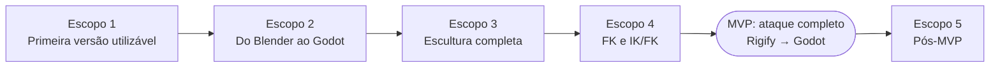

# Roadmap

> Escopos funcionais grandes. Detalhe operacional fica em [agenda.md](agenda.md). Cada escopo termina com algo que dá para **usar fazendo animação**.



Ordem: o pipeline até o Godot (baixo risco técnico) vem cedo para fechar o ciclo de ponta a ponta antes do trabalho mais arriscado (FK/tangent-space).

---

## Escopo 1 — Primeira versão utilizável

**Workflow disponível:**

```
Blender 5.2 → abrir personagem Rigify → keyar key poses (I, normal)
→ ativar tool "Animation Sculptor" em Pose Mode → trails das mãos/pés IK, torso, root, poles aparecem
→ arrastar key point: muda a pose naquele frame (soft grab com raio)
→ arrastar ponto in-between: esculpe o arco sem criar keys
→ Ctrl+arrastar key point: move a pose inteira no tempo
→ Ctrl+arrastar segmento: ease/favor (spacing) com o caminho preservado; cor de velocidade mostra o efeito
→ breakdowner/push/relax nativos no painel para breakdowns
→ Space: playback → Ctrl+Z desfaz gestos → salvar, fechar, reabrir: tudo continua (é só uma Action)
→ (manual, documentado) bake/export com ferramentas nativas → Godot
```

**Inclui:** trails do LMP vendorizado; adapters Rigify + genérico; grab/soft grab, arc drag (translação); retime e spacing (qualquer controle, escopo personagem); preview analítico; undo/cancel; painel; keymap; testes unitários + integração + checklist manual.

**Não inclui:** sculpt espacial de FK, smooth, make arc, pins, tangent handles 3D, ranges, export automatizado.

**Critérios de aceitação (todos):**

1. Instala como extensão (zip) no Blender 5.2 e habilita sem erro; desinstala sem resíduos.
2. Detecta um rig Rigify gerado do metarig Human e lista os controles com capacidades corretas; em armature não-Rigify cai no adapter genérico.
3. Trails atualizam ao trocar seleção, mudar frame, keyar, editar no Graph Editor.
4. Grab de key point em `hand_ik.L` move a mão para onde o mouse indica (erro < 1 mm no plano da vista) e a trail recalculada coincide com o preview.
5. Arc drag num in-between altera o arco sem adicionar keys nem mudar timing (verificado no Dope Sheet).
6. Retime move a pose inteira (todos os canais do personagem naquele frame) e Spacing altera a distribuição dos pontos sem mudar o caminho (verificação visual + teste automático da invariante).
7. Cada gesto = exatamente 1 passo de undo; Esc cancela restaurando as F-Curves bit a bit.
8. Salvar → fechar → reabrir: Action idêntica, ferramenta funciona, nenhum objeto/propriedade extra além das configurações da cena.
9. Playback em tempo real não piora perceptivelmente com a tool ativa (trails ocultas no playback se configurado).
10. Nenhuma dependência de IA/rede; resultado editável normalmente no Graph Editor.
11. Checklist manual "Bloqueio de ataque" ([testing/manual-tests.md](testing/manual-tests.md)) completado pelo usuário num personagem real, com feedback registrado.

---

## Escopo 2 — Do Blender ao Godot

Fechar o teste do MVP de ponta a ponta com o que o Escopo 1 já permite animar.

- Painel "Export": validação (escala em DEF, B-Bones, múltiplas raízes, modificadores), bake opcional, export glTF com preset Godot, marcação de quais Actions exportar.
- Root motion: decisão e implementação (root deform vs extração).
- Projeto Godot de teste no repo + validação headless automatizada (posições de referência).
- Verificação com GameRig e/ou Rigodotify no 5.2.
- **Loop (Action cíclica)** — parte 1: marcar a Action como loop; operador "Fechar loop" (o último frame recebe exatamente a pose do primeiro em todas as F-Curves do personagem, com tangentes iguais nas duas pontas, para não haver tranco na emenda); validação antes do export (primeira = última pose); export como loop no Godot (sufixo de nome reconhecido pelo importador, conferido no teste headless). Detalhes em [design/motion-sculpt-model.md](design/motion-sculpt-model.md#operações-futuras-escopos-24).

**Pronto quando:** o ataque do Escopo 1 chega ao Godot com posições conferidas automaticamente, pelos dois caminhos de esqueleto suportados.

---

## Escopo 3 — Escultura completa (controles de translação)

Ferramentas para polir o movimento sem Graph Editor.

- Smooth espacial (Relax/Straighten) e temporal (Gaussian/Butterworth portados).
- Make Arc; Pins (restrições no `core/solve`); tangent handles 3D editáveis.
- Seleção de pontos (box, range), operações em ranges, restrição de eixo, multi-controle.
- Retime com stretch (time beads), timing avançado (offset/overlap de partes), política final de spacing.
- Refinos de UX (pie menu, feedback, preferências).
- **Loop** — parte 2: trail de uma Action em loop desenhada fechada; editar a primeira ou a última key (grab, arc, spacing) mantém as duas pontas iguais; spacing atravessa a emenda.

**Pronto quando:** o ataque pode ser polido (arcos limpos, spacing intencional, sem tremidos) usando só o viewport em controles IK/torso/root.

---

## Escopo 4 — FK e IK/FK

- FK chain sculpt: arrastar a ponta de uma cadeia FK (braço com espada, cabeça, coluna) ⇒ solve nas rotações (Tangent-Space portado para numpy, **com quaternions**).
- Trails cientes do estado IK/FK (mostrar o controle ativo do membro).
- Snapping IK↔FK reutilizando os operadores do Rigify; bake de switch.
- Pins no FK (ex.: segurar a mão parada enquanto o tronco gira).

**Pronto quando:** um ataque com braço FK (swing de espada) pode ser esculpido no viewport ⇒ **MVP completo** (teste de aceitação de [project.md](project.md)).

---

## Escopo 5 — Pós-MVP (candidatos)

Outros adapters (Mixamo, humanoide genérico), trails relativas (espaço do personagem/root), camadas/NLA, performance profunda, publicação na extensions.blender.org.
