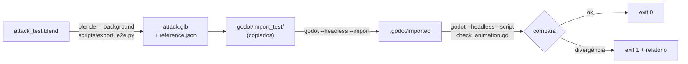

# Teste de ponta a ponta Blender → Godot

> Implementado no Escopo 2. Até lá, usar o checklist manual M3.

## Fluxo

## Referência gerada no Blender

`reference.json`: nome da animação, fps, frame range, lista de bones exportados, e posições globais (espaço do armature) de `DEF-hand.L/R`, `DEF-foot.L/R`, `DEF-spine` (hips), `DEF-spine.006` (cabeça) — nomes resolvidos pelo adapter — em cada pose key e em 5 frames intermediários.

## Checagem no Godot (`check_animation.gd`)

1. Carrega a cena importada; encontra `Skeleton3D` e `AnimationPlayer`.
2. Animação existe; duração = range/fps (tol 1 frame).
3. Bones da referência existem (nome exato ou mapeamento documentado para GameRig/Rigodotify).
4. Para cada tempo: `animation_player.seek(t, true)`, lê `skeleton.get_bone_global_pose(idx).origin`, converte do espaço Godot (Y-up) e compara com a referência (tol 1 mm × escala).
5. Imprime relatório e sai com código ≠ 0 em falha.

## Variações

- `rigify_default`: rig Rigify padrão + Deform Bones Only.
- `game_rig`: rig convertido com GameRig ou Rigodotify (o que funcionar no 5.2).
- Opcional: root motion — deslocamento de `root` ao longo da animação igual ao do Blender.

## Requisitos

Godot **4.7.2** no PATH ou `GODOT_EXE` (ver [development/setup.md](../development/setup.md)).
